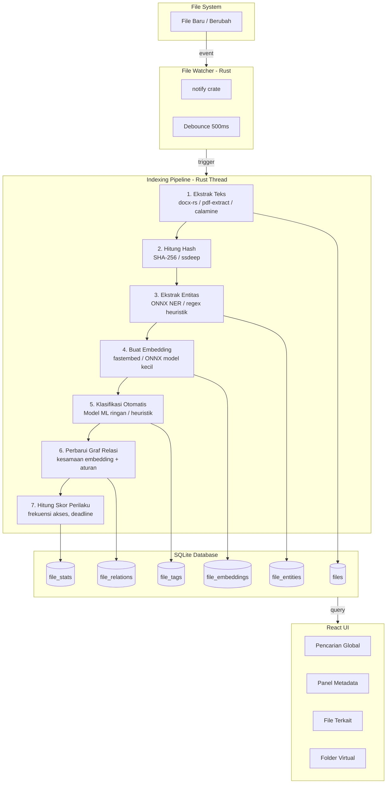
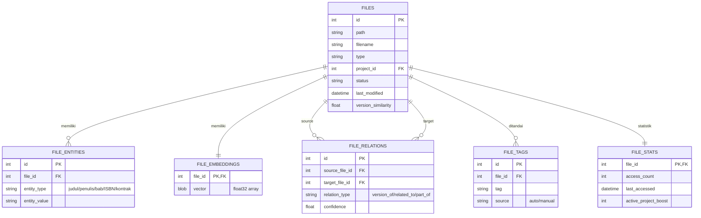
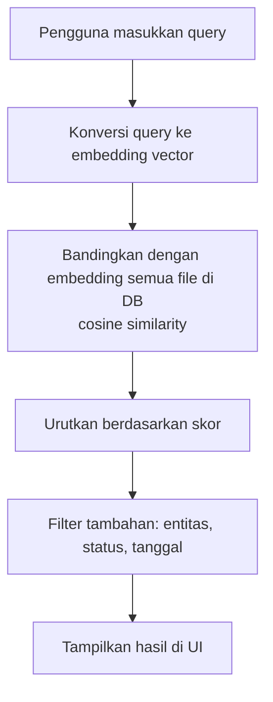

# PRODUCT REQUIREMENTS DOCUMENT (PRD)
## Modul: Smart Indexing Engine
### PubHub Desktop – Publishing Command Center

| | |
|---|---|
| **Nama Modul** | Smart Indexing Engine |
| **Produk Induk** | PubHub Desktop |
| **Platform** | Desktop (Windows & Linux) |
| **Tech Stack** | Tauri v2 (Rust) + React (TypeScript) + SQLite |
| **Prinsip Inti** | Offline-First, In-Place Organizer, RAM < 150MB idle |

---

## 1. Visi Modul

**Smart Indexing Engine** mengubah PubHub Desktop dari sekadar *file explorer* menjadi **knowledge base** yang memahami isi, konteks, dan relasi antar file dalam ekosistem penerbitan. Ia membaca file di tempatnya, mengekstrak metadata cerdas, membangun graf pengetahuan, dan menyajikan informasi yang tepat pada saat yang tepat — semua berjalan lokal tanpa internet.

### Masalah yang Diselesaikan

1. File hanya dikenali dari nama dan path, bukan dari isi atau hubungannya dengan proyek.
2. Pencarian konvensional gagal menangkap maksud pengguna (“naskah Bab 3 revisi terbaru dari Budi”).
3. Tidak ada deteksi otomatis versi, duplikat, atau kemiripan antar dokumen.
4. File tidak otomatis terkategori (naskah, kontrak, aset) tanpa usaha manual.
5. Tidak ada prioritas berbasis kebiasaan pengguna; semua file diperlakukan sama.

---

## 2. Arsitektur Smart Indexing

### 2.1 Diagram Pipeline Indexing



### 2.2 Diagram Relasi Data (Entity-Relationship)



---

## 3. Pilar Smart Indexing

### 3.1 Content-Aware Indexing

**Tujuan**: Memahami isi sebenarnya dari dokumen, bukan sekadar teks mentah.

**Proses**:
1. Ekstraksi teks penuh dari `.docx`, `.pdf`, `.xlsx` menggunakan pustaka Rust (`docx-rs`, `pdf-extract`, `calamine`).
2. Named Entity Recognition (NER) ringan via ONNX model kecil atau regex heuristik untuk mengenali:
   - **Judul Buku** – dicocokkan dengan tabel `books`
   - **Nama Penulis/Editor** – dicocokkan dengan `contacts`
   - **Nomor Bab** – pola: "Bab 1", "Chapter 2", dsb.
   - **Istilah Kunci** – ISBN, nomor kontrak, nama toko
3. Hasil disimpan di `file_entities`.

**Wireframe Panel Metadata (Panel Kanan)**:
```
┌──────────────────────────────────────────┐
│  METADATA FILE                           │
│  Nama: BukuA_Bab3_Revisi.docx            │
│  Tipe: Naskah                            │
│  Status: Revisi │ Terakhir: 19 Jun 2026  │
│  ─────────────────────────────────────── │
│  ENTITAS TERKENALI:                      │
│  📖 Judul Buku: Buku A                  │
│  ✍️  Penulis: Budi Santoso               │
│  📑 Bab: 3                              │
│  🔢 Kata Kunci: "konflik utama", ...    │
│  ─────────────────────────────────────── │
│  RINGKASAN OTOMATIS:                     │
│  "Bab ini membahas konflik utama antara  │
│   tokoh A dan B..."                      │
└──────────────────────────────────────────┘
```

### 3.2 Semantic Search & Similarity

**Tujuan**: Mencari berdasarkan makna, bukan hanya kata kunci persis. Menemukan file yang “mirip secara konten”.

**Proses**:
1. Dari teks yang diekstrak, backend menghasilkan **embedding vector** (misal model `all-MiniLM-L6-v2` via ONNX atau `fastembed` crate).
2. Embedding disimpan di `file_embeddings` (blob float32).
3. Saat pencarian, query pengguna dikonversi ke embedding, lalu dihitung **cosine similarity** terhadap semua embedding file.
4. Hasil diurutkan berdasarkan skor similarity tertinggi, digabung dengan filter lain.

**Alur Semantic Search**:


### 3.3 Relationship & Graph Indexing

**Tujuan**: Memetakan hubungan antar file, proyek, kontak, dan invoice.

**Proses**:
1. Setelah embedding dibuat, backend membandingkan embedding antar file untuk mendeteksi **kemiripan tinggi** (revisi, duplikat dekat).
2. Relasi juga dibangun berdasarkan **entitas bersama** (judul buku yang sama, penulis yang sama).
3. Relasi disimpan di `file_relations` dengan tipe:
   - `version_of` – file adalah versi lain dari file yang sama (similarity > 0.95)
   - `related_to` – file terkait via proyek/penulis yang sama
   - `part_of` – file adalah bagian dari proyek yang sama

**Wireframe Panel “File Terkait”**:
```
┌──────────────────────────────────────┐
│  TERKAIT DENGAN FILE INI:           │
│  📂 Proyek: Buku A                 │
│  📄 Versi sebelumnya (2)           │
│  📄 Kontrak penulis                │
│  🧾 Invoice terkait (1)            │
│  🖼️ Cover Buku A (3)              │
└──────────────────────────────────────┘
```

### 3.4 Auto-Classification & Tagging

**Tujuan**: Mengkategorikan file secara otomatis ke dalam jenis: Naskah, Kontrak, Aset, Promo, Legal, dll.

**Proses**:
1. Model klasifikasi teks ringan (ONNX) atau aturan heuristik berbasis kata kunci.
2. Aturan heuristik fallback:
   - Mengandung “Bab”, “Chapter” → Naskah
   - Mengandung “Perjanjian”, “Pasal” → Kontrak
   - Ekstensi gambar + mengandung “Cover”, “Banner” → Aset
3. Tag otomatis disimpan di `file_tags` dengan source `auto`. Pengguna dapat menambah tag manual (`manual`).

**Wireframe Folder Virtual**:
```
┌──────────────────────────────────────┐
│  FOLDER VIRTUAL                      │
│  ─────────────────────────────────── │
│  Kategori:                           │
│  📁 Naskah (15)                      │
│  📁 Kontrak (3)                      │
│  📁 Aset (22)                       │
│  📁 Promo (5)                        │
│  ─────────────────────────────────── │
│  Tag:                                │
│  #final (12)   #revisi (8)           │
│  #bab3 (4)     #cover (6)            │
│  ─────────────────────────────────── │
│  [+ Buat Folder Virtual Baru]        │
│  Kriteria: [_________] [Simpan]      │
└──────────────────────────────────────┘
```

### 3.5 Version & Duplicate Detection

**Tujuan**: Mengenali file-file yang merupakan revisi dari dokumen yang sama, atau duplikat persis.

**Proses**:
1. **Exact duplicate**: Hash SHA-256 konten file. Jika hash sama, tandai sebagai duplikat.
2. **Near-duplicate / Version**: Fuzzy hash `ssdeep` + cosine similarity embedding > 0.95.
3. Backend mengisi `version_similarity` di `files` dan membuat relasi `version_of` di `file_relations`.

**Wireframe Version Timeline**:
```
┌──────────────────────────────────────────────┐
│  VERSION TIMELINE - BukuA.docx               │
├──────────────────────────────────────────────┤
│  ● Versi 1 - 1 Juni 2026                     │
│  │  Dibuat oleh: Editor A                    │
│  │  Status: Draft                            │
│  │  [ Lihat ] [ Pulihkan ]                   │
│  │                                           │
│  ● Versi 2 - 5 Juni 2026                     │
│  │  Diubah oleh: Editor B                    │
│  │  Status: Revisi                           │
│  │  [ Lihat ] [ Pulihkan ]                   │
│  │                                           │
│  ● Versi 3 - 10 Juni 2026  ← Saat Ini        │
│  │  Diubah oleh: Editor A                    │
│  │  Status: Final                            │
│  │  [ Lihat ]                                │
│  ─────────────────────────────────────────── │
│  [ 🔒 Kunci Versi Ini ] [ 📊 Bandingkan ]    │
└──────────────────────────────────────────────┘
```

### 3.6 Behavioral Indexing

**Tujuan**: Mempelajari kebiasaan pengguna untuk menampilkan file yang paling relevan terlebih dahulu.

**Proses**:
1. Setiap kali file dibuka, dipreview, atau digunakan dalam invoice, backend mencatat di `file_stats`.
2. Skor relevansi dihitung dari:
   - Frekuensi akses (bobot 40%)
   - Keterkinian akses (bobot 30%)
   - Keterkaitan dengan proyek aktif (bobot 20%)
   - Deadline (bobot 10%)
3. Skor digunakan untuk mengurutkan hasil pencarian dan tampilan **Quick Access**.

---

## 4. Integrasi dengan UI

### 4.1 Pencarian Global yang Kontekstual

```
┌──────────────────────────────────────────────────┐
│  🔍 "Budi Bab 3 revisi terbaru"                 │
├──────────────────────────────────────────────────┤
│  ★ TERATAS (2)                                  │
│  📄 BukuA_Bab3_Revisi_Final.docx  (Revisi, 19/6)│
│  📄 BukuA_Bab3_Revisi2.docx       (Revisi, 17/6)│
│                                                  │
│  FILE TERKAIT (5)                               │
│  📄 Kontrak_Budi.docx                           │
│  🧾 Invoice_Budi_2026.png                      │
│  ...                                            │
└──────────────────────────────────────────────────┘
```

### 4.2 Panel “File Terkait” di Preview

Saat file dipilih di Smart Folders, panel kanan menampilkan metadata lengkap dan daftar file terkait berdasarkan relasi di `file_relations`.

### 4.3 Folder Virtual

Pengguna dapat membuat folder virtual dengan kriteria seperti:
- “Semua naskah Bab 3 yang statusnya Draft”
- “Semua kontrak yang ditandatangani tahun 2025-2026”

Folder ini hanya ada di PubHub, tidak mengubah struktur file asli.

---

## 5. Keamanan & Performa

| Aspek | Implementasi |
|-------|-------------|
| **Offline-First** | Semua model AI (NER, embedding, klasifikasi) berjalan lokal via ONNX atau crate Rust. Tidak ada data yang dikirim ke server. |
| **RAM < 150MB idle** | Pipeline indexing berjalan di thread terpisah dengan prioritas rendah. Embedding hanya dihitung untuk file teks; model AI dikuantisasi (contoh: `all-MiniLM-L6-v2` q8 hanya ~23MB). |
| **In-Place** | File tidak pernah dipindahkan atau diubah. Metadata disimpan di SQLite terpisah. |
| **Human-in-the-Loop** | Semua tindakan yang mengubah file (kunci, hapus, pindah) harus melalui konfirmasi dialog OS. Tag manual dapat ditambah pengguna. |

---

## 6. Ketergantungan Teknis (Rust Crates)

| Kategori | Crate | Keterangan |
|----------|-------|------------|
| Ekstraksi Teks | `docx-rs`, `pdf-extract`, `calamine` | Untuk `.docx`, `.pdf`, `.xlsx` |
| Hashing | `sha2`, `ssdeep` | SHA-256 & fuzzy hashing |
| NER & ML | `ort` (ONNX Runtime) atau `rust-bert` | Model ringan untuk NER, embedding |
| Embedding | `fastembed` | Alternatif ringan untuk embedding |
| File Watching | `notify` | Real-time file event |
| Database | `rusqlite` dengan feature `bundled`, `fts5` | SQLite + Full-Text Search |
| Serialisasi | `serde`, `serde_json` | Pertukaran data dengan frontend |

---

## 7. Struktur Proyek (Terkait Smart Indexing)

```
src-tauri/src/
├── indexing/
│   ├── mod.rs
│   ├── pipeline.rs          # Orkestrator pipeline indexing
│   ├── extractors/
│   │   ├── text.rs          # Ekstraksi teks dari docx/pdf/xlsx
│   │   ├── entities.rs      # NER & ekstraksi entitas
│   │   ├── embeddings.rs    # Pembuatan embedding vector
│   │   └── classifier.rs    # Klasifikasi otomatis
│   ├── relations.rs         # Pembangunan graf relasi
│   ├── duplicates.rs        # Deteksi duplikat & versi
│   └── behavioral.rs        # Skor perilaku
├── db/
│   ├── migrations/
│   │   ├── 001_files.sql
│   │   ├── 002_entities.sql
│   │   ├── 003_embeddings.sql
│   │   ├── 004_relations.sql
│   │   ├── 005_tags.sql
│   │   └── 006_stats.sql
│   └── models.rs            # Struct definitions
└── commands/
    ├── indexing.rs          # Tauri commands: reindex, search, get_related
    └── files.rs             # Operasi file via dialog OS
```

---

## 8. Alur Kerja Onboarding & Data Lama

1. **First Run Wizard**: Pengguna memilih folder penerbitan. Backend langsung memulai pemindaian dan indexing seluruh file yang ada (progress bar di UI).
2. **File Lama**: Semua file diindeks tanpa dipindahkan. Nama file tidak terstruktur dikenali dengan pola heuristik + NER. Pengguna dapat menautkan file ke proyek/buku secara manual jika tidak terdeteksi otomatis.
3. **Data Transaksi Historis**: Dapat diimpor via CSV, atau dibiarkan sebagai file gambar yang diindeks sebagai file biasa.
4. **Backup Database**: SQLite dapat dibackup dan direstore dari Pengaturan. File asli tidak terpengaruh.

---

## 9. Indikator Keberhasilan

| Metrik | Target |
|--------|--------|
| Akurasi klasifikasi otomatis | ≥ 85% untuk jenis dokumen utama (naskah/kontrak/aset) |
| Akurasi deteksi versi | ≥ 90% untuk file dengan similarity > 0.95 |
| Waktu indexing per file | < 2 detik untuk file < 10MB (diukur di PC standar) |
| RAM tambahan saat indexing | < 50MB (di luar baseline 150MB idle) |
| Peningkatan kecepatan temu balik | Pencarian menemukan file relevan dalam < 1 detik untuk koleksi < 10.000 file |

---

Dokumen PRD ini menjadi cetak biru lengkap untuk **Smart Indexing Engine** PubHub Desktop. Seluruh fitur dapat diimplementasikan secara bertahap tanpa mengubah arsitektur inti atau prinsip In-Place Organizer.