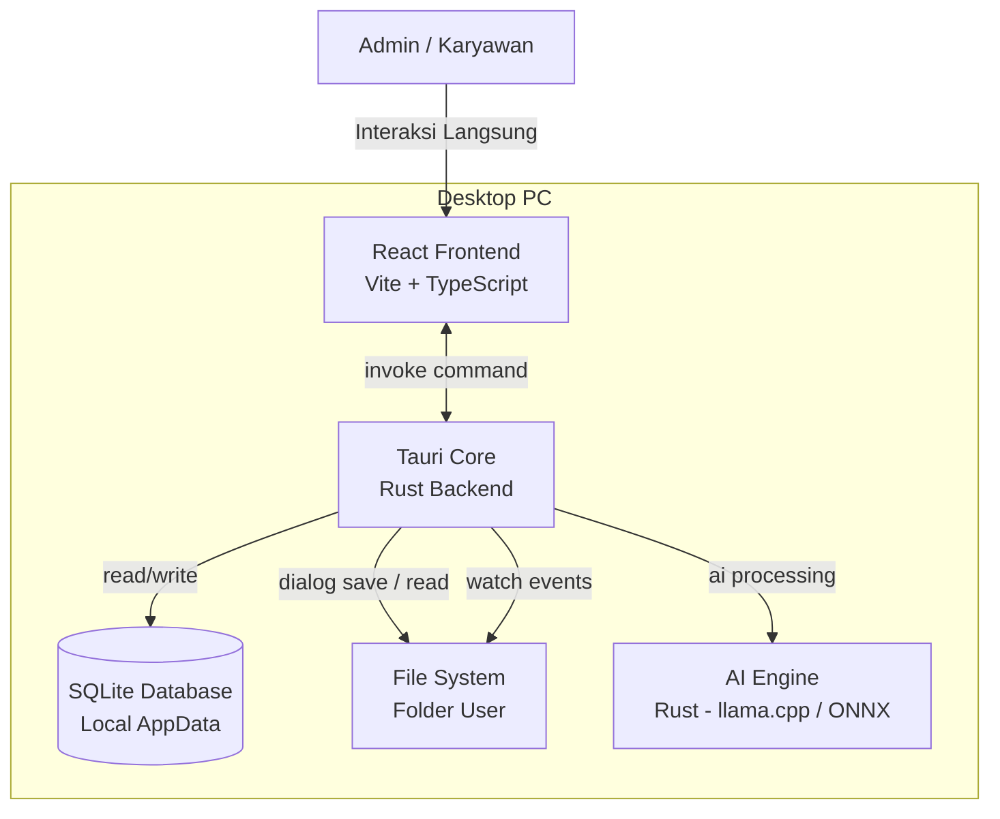
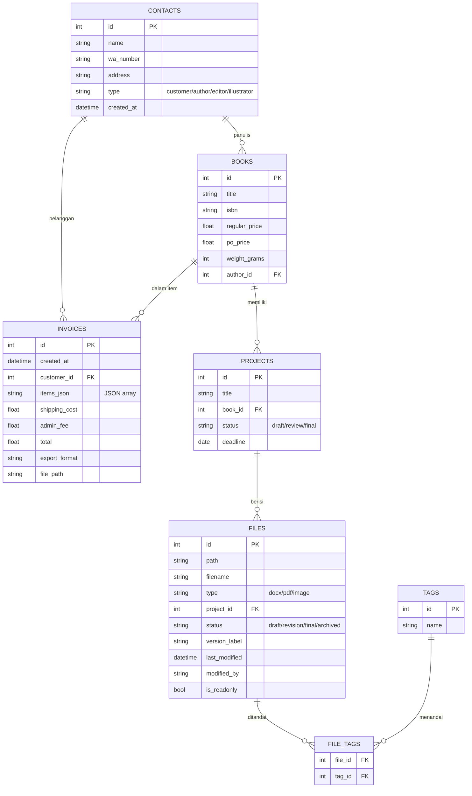
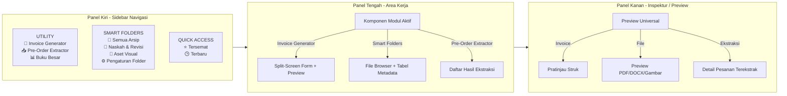
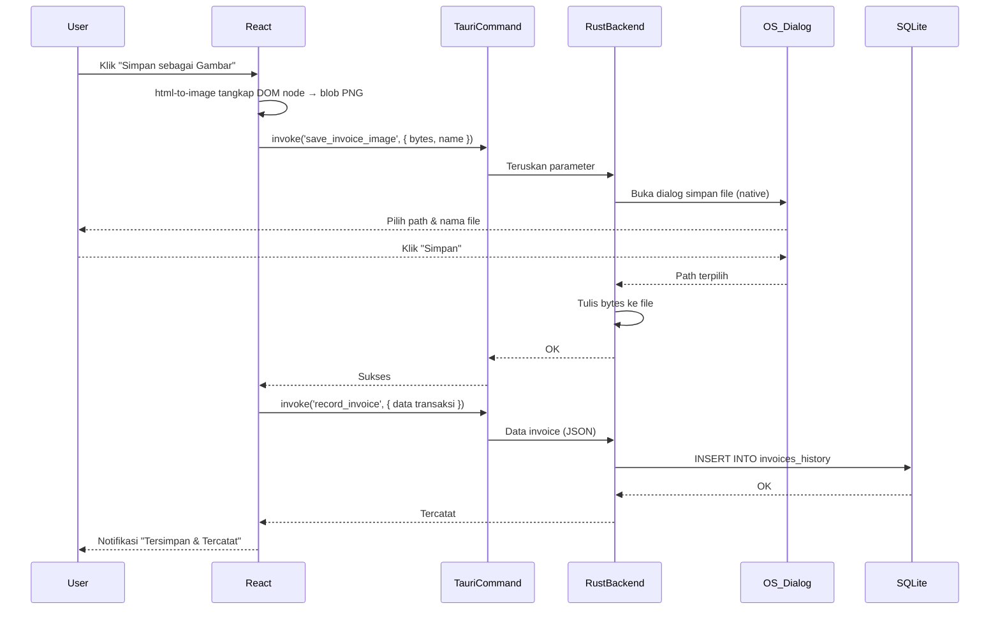
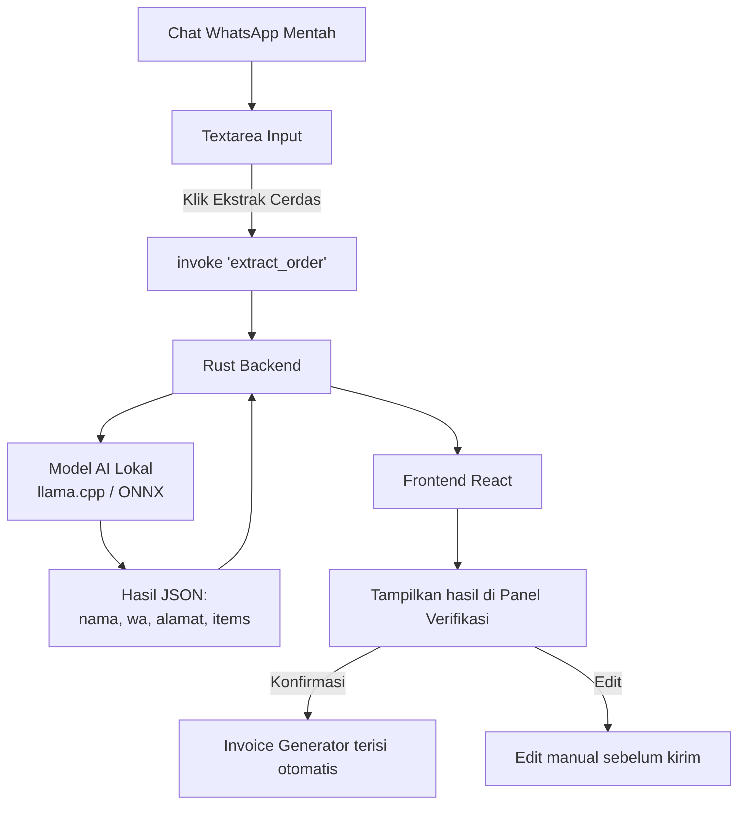
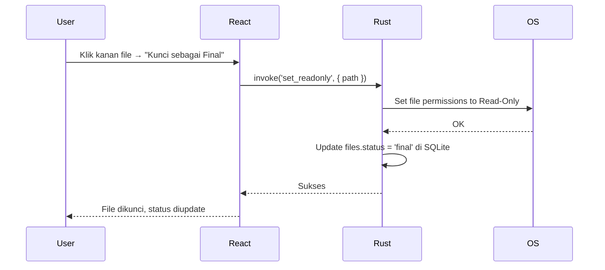
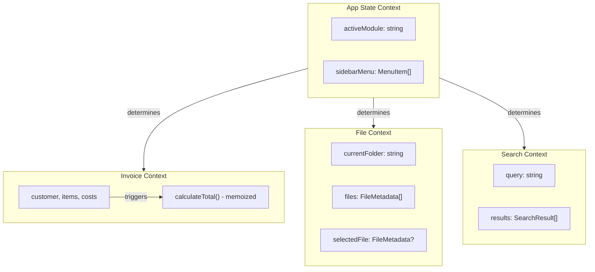
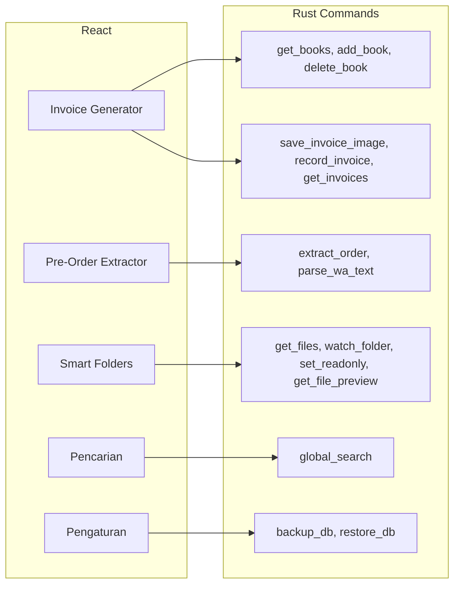

Tentu. Berikut adalah **Product Requirements Document (PRD) Lengkap** untuk **PubHub Desktop (Publishing Command Center)**, disusun sebagai satu blueprint terpadu tanpa membedakan fase. Dokumen ini mencakup visi, arsitektur teknis, seluruh fitur, wireframe berbasis teks, dan diagram Mermaid.

---

# PRODUCT REQUIREMENTS DOCUMENT (PRD)
## PubHub Desktop – Publishing Command Center

| | |
|---|---|
| **Nama Produk** | Publishing Command Center (PubHub Desktop) |
| **Platform** | Desktop (Windows & Linux) |
| **Paradigma UI** | Specialized File Explorer + Utility Modules |
| **Tech Stack** | Tauri (Rust) + React (TypeScript) + Vite + SQLite |
| **Target Pengguna** | Admin marketing, redaksi, karyawan penerbitan |
| **Prinsip Inti** | Offline-First, In-Place Organizer, Secure by Design, RAM < 150MB idle |

---

## 1. Visi Produk

**PubHub Desktop** adalah lapisan kecerdasan dan otomatisasi yang diletakkan di atas file system penerbitan yang sudah ada. Ia tidak memaksa migrasi file, tidak membutuhkan internet terus-menerus, dan tidak mengubah format dokumen. Ia bertindak sebagai "Lensa Pintar" yang membaca, mengindeks, menghubungkan, dan mempercepat seluruh alur kerja administrasi penerbitan — dari transaksi pelanggan hingga pengelolaan naskah dan aset.

### Masalah Inti yang Diselesaikan

1. **Fragmentasi Informasi**: Data pelanggan, buku, transaksi, naskah, dan aset tersebar di puluhan file dan folder tanpa hubungan satu sama lain.
2. **Proses Manual Berulang**: Admin membuang 60% waktu untuk copy-paste, mengetik ulang, menghitung manual, mencari file, dan membuat invoice dari nol.
3. **Tanpa Metadata**: File hanya memiliki nama; tidak ada catatan versi, status, pemilik, keterkaitan dengan proyek atau buku.
4. **Ketidakmampuan Menemukan Kembali**: File dan informasi hilang di tumpukan folder, apalagi saat staf berganti.
5. **Rekonsiliasi Lambat**: Rekap transaksi akhir bulan memakan waktu berhari-hari karena data terserak.

---

## 2. Arsitektur Teknis

### 2.1 Diagram Arsitektur Sistem



### 2.2 Tech Stack Detail

| Layer | Teknologi | Keterangan |
|-------|-----------|------------|
| Frontend | React + TypeScript + Vite | State management: Context + useReducer |
| Backend/OS Bridge | Tauri v2 (Rust) | Akses file system, dialog native, file watcher |
| Database | SQLite via rusqlite (bundled) | Tersimpan di `{FOLDERID_LocalAppData}/pubhub` |
| File Watcher | Rust `notify` crate | Real-time monitoring dengan debouncing |
| AI Engine (Opsional) | llama-cpp-rs / ONNX Runtime | Model NLP/LLM lokal untuk ekstraksi data |
| CI/CD | GitHub Actions | Build cross-platform Windows & Linux |

### 2.3 Database Schema



---

## 3. Struktur Antarmuka (Three-Pane Layout)



---

## 4. Wireframe Antarmuka Utama

```
┌──────────────────────────────────────────────────────────────────────────────────┐
│  PubHub Desktop - Publishing Command Center                     [_] [□] [×]      │
├────────────┬────────────────────────────────┬─────────────────────────────────────┤
│  SIDEBAR   │          AREA KERJA           │            PANEL KANAN              │
│            │                                │                                     │
│ ┌────────┐ │  ┌──────────────────────────┐ │  ┌──────────────────────────────┐    │
│ │UTILITY │ │  │    FORM INPUT            │ │  │      PRATINJAU STRUK         │    │
│ │        │ │  │                          │ │  │                              │    │
│ │🧾 Invoice│ │  │ Data Pelanggan          │ │  │  Penerbit Cahaya Ilmu       │    │
│ │ Generator│ │  │ ┌────────────────────┐ │ │  │  Jl. Pustaka No. 1          │    │
│ │  ● aktif│ │  │ │Tempel dari WA...   │ │ │  │  Telp: 021-xxxxx            │    │
│ │        │ │  │ └────────────────────┘ │ │  │                              │    │
│ │📥 Pre-  │ │  │ [ ✨ Parse Otomatis ]  │ │  │  INVOICE PRE-ORDER          │    │
│ │  Order  │ │  │ Nama: [_________]     │ │  │                              │    │
│ │  Extract│ │  │ WA  : [_________]     │ │  │  Kepada:                    │    │
│ │        │ │  │ Almt: [_________]     │ │  │  Budi Santoso               │    │
│ │📊 Buku  │ │  │                       │ │  │  08123456789                │    │
│ │  Besar  │ │  │ Item Pesanan          │ │  │  Jl. Melati No. 5           │    │
│ └────────┘ │  │ ┌───────────────────┐  │ │  │                              │    │
│            │  │ │[Buku A ▼] Qty:2  │  │ │  │  -------------------------  │    │
│ ┌────────┐ │  │ │Diskon:5000 [×]   │  │ │  │  Rincian Pesanan             │    │
│ │SMART   │ │  │ │Subtotal:Rp100.000│  │ │  │                              │    │
│ │FOLDERS │ │  │ └───────────────────┘  │ │  │  Buku A                      │    │
│ │        │ │  │ [+ Tambah Buku]        │ │  │  2 x Rp 50.000  = Rp 100.000│    │
│ │📂 Semua│ │  │                       │ │  │  Diskon         - Rp   5.000│    │
│ │  Arsip │ │  │ Biaya Tambahan        │ │  │                              │    │
│ │        │ │  │ Ongkir : [ 15000 ]    │ │  │  Buku B                      │    │
│ │📝 Naskah│ │  │ Admin  : [ 0     ]   │ │  │  1 x Rp 35.000  = Rp  35.000│    │
│ │  &Revisi│ │  │                       │ │  │  -------------------------  │    │
│ │        │ │  │ [💾 Simpan Gambar]     │ │  │  Subtotal        Rp 130.000│    │
│ │🎨 Aset │ │  │ [📋 Salin Gambar]     │ │  │  Ongkir          Rp  15.000│    │
│ │  Visual │ │  │ [🕒 Riwayat]          │ │  │  Admin           Rp   0     │    │
│ │        │ │  └──────────────────────────┘ │  │  =========================  │    │
│ │⚙️ Atur │ │                                │  │  TOTAL           Rp 145.000│    │
│ │  Folder│ │                                │  │                              │    │
│ └────────┘ │                                │  │  * Terima kasih *            │    │
│            │                                │  └──────────────────────────────┘    │
└────────────┴────────────────────────────────┴─────────────────────────────────────┘
```

---

## 5. Fitur Lengkap

### 5.1 Invoice Generator

**Tujuan**: Memangkas pembuatan invoice dari 12-15 menit menjadi 30 detik.

**Cara Kerja**:
1. Admin menyalin chat WhatsApp pelanggan (Nama, No WA, Alamat) dan menempelkannya ke textarea.
2. Klik "Parse Otomatis" → form terisi berdasarkan baris teks.
3. Admin menambahkan item pesanan dari dropdown buku (data diambil dari database lokal `books`).
4. Setiap perubahan Qty, Diskon, Ongkir, atau Admin Fee langsung memperbarui pratinjau invoice di panel kanan secara real-time.
5. Admin dapat menyimpan invoice sebagai gambar (PNG/JPG) melalui dialog simpan native, atau menyalinnya langsung ke clipboard untuk ditempel di WhatsApp.
6. Setiap ekspor otomatis tercatat di `invoices_history` (Shadow Ledger).

**Wireframe Form Invoice (Close-up)**:
```
┌─────────────────────────────────────────┐
│             FORM INPUT                  │
├─────────────────────────────────────────┤
│  DATA PELANGGAN                         │
│  ┌─────────────────────────────────────┐│
│  │ Tempel data dari WhatsApp di sini... ││
│  └─────────────────────────────────────┘│
│  [ ✨ Parse Otomatis ] [ 🧠 Ekstrak AI ] │
│                                         │
│  Nama   : [ Budi Santoso            ]   │
│  No WA  : [ 08123456789            ]    │
│  Alamat : [ Jl. Melati No. 5       ]   │
│                                         │
│  ─────────────────────────────────────  │
│  ITEM PESANAN                           │
│  ┌─────────────────────────────────────┐│
│  │ [Buku A (PO: 50k)  ▼] Qty:[2]     ││
│  │ Diskon: [ 5000 ]     [× Hapus]     ││
│  │ Subtotal: Rp 100.000               ││
│  └─────────────────────────────────────┘│
│  ┌─────────────────────────────────────┐│
│  │ [Buku B (PO: 35k)  ▼] Qty:[1]     ││
│  │ Diskon: [ 0    ]     [× Hapus]     ││
│  │ Subtotal: Rp 35.000                ││
│  └─────────────────────────────────────┘│
│  [+ Tambah Buku]                        │
│                                         │
│  ─────────────────────────────────────  │
│  BIAYA TAMBAHAN                         │
│  Ongkos Kirim : [ 15000 ]               │
│  Biaya Admin  : [ 0     ]               │
│                                         │
│  ─────────────────────────────────────  │
│  [ 💾 Simpan sebagai Gambar ]           │
│  [ 📋 Salin ke Clipboard  ]            │
└─────────────────────────────────────────┘
```

**Alur Ekspor & Pencatatan (Sequence Diagram)**:


---

### 5.2 Manajemen Buku & Kontak

**Tujuan**: Satu sumber kebenaran untuk data buku dan pelanggan, digunakan oleh semua modul.

**Cara Kerja**:
- Admin dapat membuka modal "Kelola Buku" untuk menambah, mengedit, atau menghapus data buku (Judul, ISBN, Harga Reguler, Harga PO, Berat).
- Data buku muncul di dropdown saat membuat invoice, tidak perlu diketik ulang.
- Setiap pelanggan baru yang muncul dari invoice otomatis disimpan ke tabel `contacts`.

**Wireframe Modal Kelola Buku**:
```
┌──────────────────────────────────────────────┐
│  Kelola Daftar Buku                      [×] │
├──────────────────────────────────────────────┤
│                                              │
│  ┌─────────────────────────────────────┐     │
│  │ Judul: [___________________]        │     │
│  │ ISBN : [___________________]        │     │
│  │ Harga Reguler: [_________]          │     │
│  │ Harga PO     : [_________]          │     │
│  │ Berat (gram) : [_________]          │     │
│  │ [➕ Tambahkan]                      │     │
│  └─────────────────────────────────────┘     │
│                                              │
│  Daftar Buku:                                │
│  ┌────┬───────────┬──────┬──────┬──────┬────┐│
│  │ No │ Judul     │ Hrg  │ PO   │ Berat│Aksi││
│  ├────┼───────────┼──────┼──────┼──────┼────┤│
│  │ 1  │ Buku A    │ 75000│ 50000│ 200  │❌ ││
│  │ 2  │ Buku B    │ 50000│ 35000│ 150  │❌ ││
│  └────┴───────────┴──────┴──────┴──────┴────┘│
│  [ Tutup ]                                   │
└──────────────────────────────────────────────┘
```

---

### 5.3 Pre-Order Extractor (Fase 1: Parser Teks / Regex; Fase 2: AI-Powered Lokal)

**Tujuan**: Mengubah chat WhatsApp yang tidak terstruktur menjadi data form yang siap pakai dalam hitungan detik.

**Cara Kerja**:
> [!NOTE]
> Integrasi AI Model Lokal (llama.cpp/ONNX) direncanakan untuk **Fase 2**. Saat ini, ekstraksi data chat WhatsApp menggunakan **Parser Teks/Regex teroptimasi** di frontend.

1. Admin menyalin seluruh chat WA (bisa berisi basa-basi, pemesanan, alamat) ke textarea khusus.
2. Klik "Ekstrak" → sistem memproses teks dengan regex untuk mengekstrak:
   - Nama pelanggan
   - Nomor WA
   - Alamat pengiriman
   - Item buku + jumlah
   - Permintaan diskon
3. Hasil ekstraksi ditampilkan di panel tengah untuk verifikasi.
4. Jika benar, klik "Kirim ke Invoice Generator" → membuka modul Invoice Generator dengan data terisi otomatis.

**Wireframe Pre-Order Extractor**:
```
┌──────────────────────────────────────────────────────────────┐
│                    PRE-ORDER EXTRACTOR                       │
├───────────────────────────┬──────────────────────────────────┤
│  INPUT CHAT WA            │  HASIL EKSTRAKSI                 │
│                           │                                  │
│  ┌─────────────────────┐  │  Nama    : Budi Santoso    ✓     │
│  │Halo kak, saya Budi  │  │  No WA   : 08123456789    ✓     │
│  │Santoso. Saya mau    │  │  Alamat  : Jl. Melati 5   ✓     │
│  │pesan:               │  │                                  │
│  │- Buku A 2 eks       │  │  Item Pesanan:                   │
│  │- Buku B 1           │  │  ┌────┬─────────┬────┬──────┐    │
│  │Alamat: Jl. Melati 5 │  │  │ No │ Buku    │ Qty│ Harga│   │
│  │No WA: 08123456789   │  │  ├────┼─────────┼────┼──────┤   │
│  │Bisa diskon gak?     │  │  │ 1  │ Buku A  │ 2  │ 50000│   │
│  └─────────────────────┘  │  │ 2  │ Buku B  │ 1  │ 35000│   │
│                           │  └────┴─────────┴────┴──────┘    │
│  [ 🧠 Ekstrak Cerdas ]   │                                  │
│                           │  [ ✅ Kirim ke Invoice Gen ]     │
│                           │  [ ✏️ Edit Manual ]              │
└───────────────────────────┴──────────────────────────────────┘
```

**Diagram Alur AI Extraction**:


---

### 5.4 Smart Folders – Integrasi Google Drive & Arsip Cloud (Multi-Akun)

**Tujuan**: Mengintegrasikan penyimpanan cloud Google Drive secara terpadu tanpa mengubah struktur file asli di cloud, mendukung multi-akun, serta menyediakan antarmuka navigasi virtual file manager.

**Cara Kerja**:
1. **Pendaftaran Akun Baru**: Pengguna mendaftarkan akun Google Drive melalui menu pengaturan. Proses otorisasi berjalan otomatis menggunakan port lokal OAuth `50007`.
2. **Virtual Folder per Akun**: File manager menampilkan folder root virtual Google Drive yang berisi daftar folder akun terhubung (misal: `gdrive://ac_akun1@gmail.com`, `gdrive://ac_akun2@gmail.com`).
3. **Drive Saya & Shared With Me**: Di dalam setiap folder akun, terdapat subfolder virtual:
   - `Drive Saya` (`md_email`): Menampilkan berkas pribadi milik pengguna di Drive.
   - `Shared with me` (`swm_email`): Menampilkan berkas milik pengguna lain yang dibagikan ke akun tersebut.
4. **Penyelarasan Metadata**: Tombol "Sinkronisasi Sekarang" mengambil data berkas dari Google Drive API secara massal (melalui pagination), mencatat metadata penting (nama file, tipe mime, ukuran, ID parent, tanda shared, email pemilik) ke dalam database SQLite lokal.
5. **Download On-Demand**: Berkas yang diindeks tidak langsung diunduh secara fisik ke komputer pengguna. Ketika berkas dibuka/diklik, aplikasi mengunduh berkas secara otomatis ke direktori cache lokal dengan menggunakan token milik akun Google Drive terkait.
6. **Local Folder Watcher (Fase 2)**: Fitur pemantauan folder lokal real-time menggunakan crate `notify` direncanakan pada pengembangan fase berikutnya.

**Wireframe Smart Folders (Google Drive)**:
```
┌─────────────────────────────────────────────────────────────────────────────────┐
│                            SMART FOLDERS - CLOUD                                │
├────────────┬─────────────────────────────────────────┬──────────────────────────┤
│  FOLDER    │  DAFTAR FILE                            │  PREVIEW                 │
│  TREE      │                                         │                          │
│            │  Path: Google Drive \                   │  ┌────────────────────┐  │
│  ☁️ GDrive  │  ┌───────────────────────────────────┐  │  │                    │  │
│   📁 ac_1  │  │ 🔍 Cari file...                    │  │  │   PREVIEW PDF      │  │
│    📁 md_1 │  │ Filter: [Semua ▼]                  │  │  │                    │  │
│    📁 swm_1│  ├───┬──────────────┬──────┬──────┬───┤  │  │   Naskah Buku A    │  │
│   📁 ac_2  │  │   │ Nama File    │ Tgl   │Status│Tag│  │  │   Bab 1-3          │  │
│    📁 md_2 │  │ ★ │BukuA_Rev3.pdf│19 Jun │Cloud │   │  │  │                    │  │
│    📁 swm_2│  │   │BukuA_Cover   │18 Jun │Cloud │⭐ │  │  │   ...isi dokumen... │  │
│            │  │   │BukuB_Draft   │17 Jun │Cloud │   │  │  │                    │  │
│  [+ Hubung]│  │   │Banner_Lebaran│15 Apr │Cloud │⭐ │  │  │                    │  │
│            │  └───┴──────────────┴──────┴──────┴───┘  │  └────────────────────┘  │
│            │  [🔄 Sinkronisasi] [🗑️ Hapus Metadata]   │                          │
└────────────┴─────────────────────────────────────────┴──────────────────────────┘
```

**Cloud Sync & Download Architecture**:
```mermaid
flowchart TD
    subgraph GD [Google Drive Cloud]
        API[Google Drive API v3]
    end

    subgraph App [PubDesk Application]
        OAuth[OAuth 2.0 Loopback Server]
        Sync[Sync Manager]
        Cache[Cache Manager]
    end

    subgraph DB [SQLite Lokal]
        Files[(Tabel Files)]
    end

    OAuth -->|Mendapatkan Token| API
    Sync -->|Tarik Metadata File| API
    Sync -->|Simpan Indeks Cloud| Files
    Cache -->|Download On-Demand via Token Akun| API
    Cache -->|Tulis Cache Berkas Fisik| LocalDisk[(Local Cache Disk)]
end
```

---

### 5.5 Smart Context Menu

**Tujuan**: Memberikan aksi bisnis langsung dari file list.

**Menu Konteks (Klik Kanan pada File)**:
```
┌─────────────────────────────┐
│  📄 BukuA_Revisi3.docx      │
├─────────────────────────────┤
│  👁️  Preview               │
│  📂  Buka Folder            │
│  📋  Salin Path             │
│  ───────────────────────    │
│  🔒  Kunci sebagai Final    │
│  🏷️   Tambah Tag...         │
│  📦  Tandai Arsip           │
│  ⚠️   Tandai Butuh Revisi   │
│  ───────────────────────    │
│  🕒  Lihat Riwayat Versi    │
│  🔗  Tautkan ke Proyek...   │
│  ❌  Hapus (aman)           │
└─────────────────────────────┘
```

**Aksi "Kunci sebagai Final"**:


---

### 5.6 Buku Besar Virtual (Dashboard Transaksi)

**Tujuan**: Satu tempat untuk melihat, mencari, dan mengekspor seluruh riwayat transaksi.

**Wireframe Buku Besar**:
```
┌──────────────────────────────────────────────────────────────────┐
│                      BUKU BESAR VIRTUAL                          │
├──────────────────────────────────────────────────────────────────┤
│  Ringkasan:                                                      │
│  ┌──────────────┬──────────────┬──────────────┬──────────────┐   │
│  │ Total Invoice│ Bulan Ini    │ Belum Dibayar│ Rata2/hari   │   │
│  │    156       │ Rp 12.500.000│ Rp 3.200.000 │ Rp 625.000   │   │
│  └──────────────┴──────────────┴──────────────┴──────────────┘   │
│                                                                  │
│  Filter: [Tanggal ▼] [Pelanggan ▼] [Buku ▼]  🔍 Cari...        │
│                                                                  │
│  ┌────┬────────────┬───────────┬──────────┬──────────┬──────────┐│
│  │ No │ Tanggal    │ Pelanggan │ Item     │ Total    │ Aksi     ││
│  ├────┼────────────┼───────────┼──────────┼──────────┼──────────┤│
│  │ 1  │ 19 Jun 2026│ B.Santoso │ Buku A,B │ 145.000  │ 👁️📋    ││
│  │ 2  │ 18 Jun 2026│ A.Wijaya  │ Buku C   │ 95.000   │ 👁️📋    ││
│  └────┴────────────┴───────────┴──────────┴──────────┴──────────┘│
│                                                                  │
│  [ 📥 Ekspor CSV ]  [ 📊 Grafik ]                                │
└──────────────────────────────────────────────────────────────────┘
```

---

### 5.7 Version Timeline (Fase 2 - Direncanakan)

**Tujuan**: Melihat riwayat perubahan file naskah secara kronologis.

> [!NOTE]
> Fitur ini direncanakan untuk **Fase 2** dan akan melacak riwayat revisi berkas naskah lokal maupun cloud secara kronologis.

**Wireframe Version Timeline**:
```
┌──────────────────────────────────────────────────────────────┐
│              VERSION TIMELINE - BukuA.docx                   │
├──────────────────────────────────────────────────────────────┤
│                                                              │
│  ● Versi 1 - 1 Juni 2026                                    │
│  │  Dibuat oleh: Editor A                                   │
│  │  Status: Draft                                           │
│  │  [ Lihat ] [ Pulihkan ]                                  │
│  │                                                          │
│  ● Versi 2 - 5 Juni 2026                                    │
│  │  Diubah oleh: Editor B                                   │
│  │  Status: Revisi                                          │
│  │  [ Lihat ] [ Pulihkan ]                                  │
│  │                                                          │
│  ● Versi 3 - 10 Juni 2026  ← Saat Ini                       │
│  │  Diubah oleh: Editor A                                   │
│  │  Status: Final                                           │
│  │  [ Lihat ]                                               │
│  │                                                          │
│  ─────────────────────────────────────────────              │
│  [ 🔒 Kunci Versi Ini ]  [ 📊 Bandingkan Versi ]            │
└──────────────────────────────────────────────────────────────┘
```

---

### 5.8 Pencarian Global

**Tujuan**: Menemukan apa pun dalam satu ketikan.

**Cara Kerja**:
- `Ctrl+F` di mana saja memunculkan bilah pencarian.
- Mencari di seluruh database: nama file, isi dokumen (via FTS5), nama pelanggan, judul buku, tag.
- Hasil ditampilkan dalam kategori: File, Invoice, Kontak, Proyek.

**Wireframe Pencarian Global**:
```
┌──────────────────────────────────────────────────┐
│  🔍 "Buku A"                                    │
├──────────────────────────────────────────────────┤
│                                                  │
│  FILE (3)                                       │
│  ┌──────────────────────────────────────────┐   │
│  │ 📄 BukuA_Final.docx    Naskah/2026/      │   │
│  │ 📄 BukuA_Cover.png     Aset/Cover/       │   │
│  │ 📄 BukuA_Kontrak.docx  Legal/            │   │
│  └──────────────────────────────────────────┘   │
│                                                  │
│  INVOICE (12)                                   │
│  ┌──────────────────────────────────────────┐   │
│  │ 🧾 Budi S. - 19 Jun 2026 - Rp 145.000   │   │
│  │ 🧾 Ani W.  - 18 Jun 2026 - Rp 95.000    │   │
│  └──────────────────────────────────────────┘   │
│                                                  │
│  KONTAK (2)                                     │
│  ┌──────────────────────────────────────────┐   │
│  │ 👤 Budi Santoso - 08123456789            │   │
│  │ 👤 Ani Wijaya   - 08765432100            │   │
│  └──────────────────────────────────────────┘   │
│                                                  │
└──────────────────────────────────────────────────┘
```

---

### 5.9 Quick Capture (Fase 2 - Direncanakan)

**Tujuan**: Membuat invoice tanpa membuka jendela utama.

> [!NOTE]
> Fitur window sekunder melayang dan shortcut global ini direncanakan untuk **Fase 2**.

**Cara Kerja**:
- `Ctrl+Shift+P` memunculkan popup kecil di atas semua jendela.
- Admin menempelkan chat WA, klik "Proses Cepat".
- Sistem mengekstrak data, membuat invoice, dan menyalin gambar ke clipboard.
- Notifikasi: "Invoice siap, tinggal paste di WA."

**Wireframe Quick Capture**:
```
┌────────────────────────────────────┐
│  PubHub Quick Capture         [×] │
├────────────────────────────────────┤
│                                    │
│  ┌──────────────────────────────┐  │
│  │ Tempel chat WA di sini...    │  │
│  │                              │  │
│  └──────────────────────────────┘  │
│                                    │
│  [ ⚡ Proses Cepat ]               │
│                                    │
│  Status: Siap dikirim ✓           │
│                                    │
└────────────────────────────────────┘
```

---

### 5.10 Pengaturan & Konfigurasi (Pengaturan Umum & Google Drive)

**Wireframe Pengaturan Umum (Integrasi Google Drive)**:
```
┌──────────────────────────────────────────────────────────────────────────────┐
│                    PENGATURAN UMUM & GOOGLE DRIVE                            │
├──────────────────────────────────────────────────────────────────────────────┤
│                                                                              │
│  👤 AKUN TERHUBUNG:                                                          │
│  ┌────────────────────────────────────────────────────────────────────────┐  │
│  │ Budi Santoso (budi@gmail.com)                            [ Disconnect ]│  │
│  │ Ani Wijaya (ani@gmail.com)                               [ Disconnect ]│  │
│  └────────────────────────────────────────────────────────────────────────┘  │
│  [ ➕ Hubungkan Akun Google Baru (OAuth Browser) ]                            │
│                                                                              │
│  ☁️ INTEGRASI MANUAL / JANGKA PANJANG (Autosave State + Simpan manual):        │
│  Google Drive OAuth2 Access Token:                                           │
│  [ ********************************************************** ] [ Tampilkan ]│
│                                                                              │
│  Google Client ID:                                                           │
│  [ 935478440552-k48b61cglp06gskchsc7qg6l2i1pkhn1.apps.google.com            ]│
│                                                                              │
│  Google Client Secret:                                                       │
│  [ ****************************************** ] [👁]                          │
│                                                                              │
│  Google OAuth2 Refresh Token:                                                │
│  [ ****************************************** ]                              │
│                                                                              │
│  ID Folder Induk (Opsional):                                                 │
│  [ Kosongkan untuk menyinkronkan seluruh Drive                              ]│
│                                                                              │
│  ──────────────────────────────────────────────────────────────────────────  │
│  [ 💾 Simpan Konfigurasi ]  [ 🔄 Sinkronisasi Sekarang ]                     │
│                                                   [ 🗑️ Hapus Metadata Drive ]│
└──────────────────────────────────────────────────────────────────────────────┘
```

**Keterangan Aksi**:
- **Simpan Konfigurasi**: Menyimpan isian token/kredensial ke `localStorage` lokal, menampilkan toast notifikasi sukses, dan memverifikasi koneksi.
- **Sinkronisasi Sekarang**: Memulai penarikan berkas metadata secara serial dari semua akun terhubung.
- **Hapus Metadata Drive**: Menghapus seluruh berkas metadata Google Drive lokal di database aplikasi tanpa memengaruhi cache berkas fisik.

---

## 6. Alur Data & State Management

### 6.1 State Management Architecture



### 6.2 Tauri Commands Map



---

## 7. Keamanan & Prinsip Utama

| Prinsip | Implementasi |
|---------|-------------|
| **Human-in-the-Loop** | Semua operasi file (simpan, hapus, ubah izin) harus melalui dialog OS atau konfirmasi eksplisit. Tidak ada akses file otomatis tanpa sepengetahuan pengguna. |
| **Offline-First** | Semua data disimpan di SQLite lokal. Model AI berjalan lokal. Tidak ada ketergantungan internet untuk operasi inti. |
| **RAM < 150MB idle** | Optimalisasi React (memo, lazy load), Rust backend minimal, preview file di-render secara efisien. |
| **Tidak mengubah file system** | Aplikasi hanya membaca dan mengindeks. Tidak memindahkan, mengganti nama, atau menghapus file tanpa perintah eksplisit dari pengguna. |
| **Database terenkripsi (opsional)** | SQLite dapat dienkripsi dengan SQLCipher untuk keamanan tambahan. |

---

## 8. Struktur Proyek Akhir

```
pubhub-desktop/
├── src/                          # React Frontend
│   ├── components/
│   │   ├── layout/
│   │   │   ├── Sidebar.tsx
│   │   │   ├── MainLayout.tsx
│   │   │   └── PanelKanan.tsx
│   │   ├── invoice/
│   │   │   ├── InvoiceForm.tsx
│   │   │   ├── InvoicePreview.tsx
│   │   │   ├── ExportButtons.tsx
│   │   │   └── InvoiceContext.tsx
│   │   ├── extractor/
│   │   │   ├── ExtractorPanel.tsx
│   │   │   └── ExtractedResult.tsx
│   │   ├── files/
│   │   │   ├── FileBrowser.tsx
│   │   │   ├── FilePreview.tsx
│   │   │   ├── ContextMenu.tsx
│   │   │   └── VersionTimeline.tsx
│   │   ├── ledger/
│   │   │   └── BukuBesar.tsx
│   │   ├── search/
│   │   │   └── GlobalSearch.tsx
│   │   ├── quickcapture/
│   │   │   └── QuickCapturePopup.tsx
│   │   └── settings/
│   │       └── SettingsPanel.tsx
│   ├── context/
│   │   ├── AppContext.tsx
│   │   ├── InvoiceContext.tsx
│   │   ├── FileContext.tsx
│   │   └── SearchContext.tsx
│   ├── lib/
│   │   ├── commands.ts         # Tauri invoke wrappers
│   │   ├── parser.ts           # Regex parser untuk WA
│   │   └── export.ts           # html-to-image logic
│   └── App.tsx
│
├── src-tauri/                    # Rust Backend
│   ├── src/
│   │   ├── main.rs
│   │   ├── lib.rs
│   │   ├── db.rs                # SQLite init & migrations
│   │   ├── commands/
│   │   │   ├── books.rs
│   │   │   ├── invoice.rs
│   │   │   ├── extractor.rs
│   │   │   ├── files.rs
│   │   │   ├── search.rs
│   │   │   └── settings.rs
│   │   ├── watcher.rs           # File system watcher
│   │   ├── ai.rs                # AI model integration
│   │   └── models.rs            # Struct definitions
│   ├── Cargo.toml
│   └── capabilities/
│       └── default.json         # Permissions
│
└── package.json
```

---

Dokumen PRD ini adalah cetak biru lengkap PubHub Desktop. Semua fitur, antarmuka, arsitektur, dan aliran data telah terdokumentasi dalam satu naskah terpadu. Anda dapat menggunakannya langsung sebagai panduan pengembangan bertahap sesuai urutan prioritas yang Anda tetapkan.