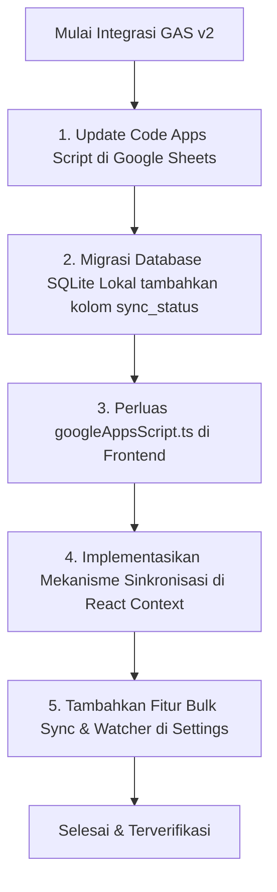

# Analisis Integrasi Google Apps Script (GAS) v2: Sinkronisasi Multi-Entitas dan Google Drive

Dokumen ini menganalisis pembaruan yang diperlukan pada integrasi Google Apps Script (GAS) agar seluruh data dan berkas di dalam aplikasi **PubHub Desktop (PubDesk)** dapat disinkronkan secara aman ke Google Sheets dan Google Drive.

---

## 1. Analisis Kondisi Saat Ini (v1) & Kesenjangan (Gaps)

### Kondisi Saat Ini:
1. **Terbatas pada Invoice**: Integrasi GAS saat ini (`docs/google-apps-script/code.js`) hanya memiliki sheet `Invoices` dan aksi `create_invoice` (POST) serta `get_invoices` (GET).
2. **Folder Drive Tunggal**: Berkas PDF Invoice disimpan langsung di bawah satu folder induk (`PubDesk Invoices`).
3. **Status Sinkronisasi Lokal**: Kolom `sync_status` dan `cloud_file_url` hanya ada pada tabel `invoices` di SQLite lokal.
4. **CORS Handle**: Pemanggilan API GAS dilakukan melalui Tauri Command `call_gas_api` di Rust untuk menghindari batasan CORS pada browser.

### Kesenjangan (Gaps) untuk Sinkronisasi Seluruh Aplikasi:
*   **Data Master & Transaksi Belum Tersinkron**: Entitas Penulis, Penerbit, Naskah Orders, Tim, Legalitas, Buku, Layanan, dan Tugas (Tasks) belum memiliki jalur sinkronisasi ke cloud.
*   **Belum Ada Struktur Multi-Sheet**: Google Apps Script belum mendukung inisialisasi dan penulisan ke lembar kerja (sheet) lain selain `Invoices`.
*   **Kurangnya Kolom Sinkronisasi di Database**: Tabel SQLite selain `invoices` belum memiliki kolom pelacakan sinkronisasi (`sync_status`, `updated_at`, `cloud_id`).
*   **Struktur Folder Drive Masih Rata (Flat)**: Berkas-berkas selain PDF Invoice (seperti Cover Buku, Draft Naskah, Bukti Legalitas/Tugas) memerlukan organisasi folder yang rapi berdasarkan jenis entitas atau kode naskah.

---

## 2. Pembaruan yang Diperlukan (Rancangan Arsitektur GAS v2)

Untuk menduplikasi seluruh database lokal ke Google Sheets dan mengunggah dokumen fisik ke Google Drive, diperlukan pembaruan di tiga lapisan:

```
┌─────────────────────────┐     Tauri IPC     ┌────────────────────────┐     HTTP Request     ┌─────────────────────────┐
│    React Frontend       │ ────────────────> │      Rust Backend      │ ───────────────────> │   Google Apps Script    │
│  (Trigger Sync & UI)    │ <──────────────── │   (SQLite & GAS Call)  │ <─────────────────── │   (Sheets & Drive API)  │
└─────────────────────────┘                   └────────────────────────┘                      └─────────────────────────┘
```

### A. Sisi Google Apps Script (`code.js` v2)
GAS harus diubah agar bersifat **dinamis** dan **modular**:
1.  **Dinamis Berdasarkan Target Sheet**: Menerima parameter `sheet_name` dan secara otomatis memformat/membuat sheet tersebut beserta header-nya jika belum ada.
2.  **Mendukung Operasi Batch / Bulk Sync**: Menerima array data dalam satu request POST untuk mempercepat proses sinkronisasi dan mengurangi jumlah kuota pemanggilan Apps Script harian.
3.  **Organisasi Folder Google Drive**: Mengorganisir berkas unggahan ke subfolder yang sesuai (misalnya: `/PubDesk/Invoices`, `/PubDesk/Naskah`, `/PubDesk/Covers`, `/PubDesk/Legalitas`).
4.  **Aksi CRUD Generik**:
    *   `upsert_records`: Menambah atau memperbarui data berdasarkan kunci unik (ID lokal).
    *   `get_records`: Membaca seluruh baris dari sheet tertentu.
    *   `delete_record`: Menghapus baris dari sheet berdasarkan ID lokal.

### B. Sisi Database SQLite (`schema.rs`)
Setiap tabel yang ingin disinkronkan harus ditambahkan kolom pendukung melalui migrasi database:
*   `sync_status` (TEXT): Status sinkronisasi lokal (`pending`, `synced`, `failed`).
*   `cloud_file_url` (TEXT - Opsional): URL Drive jika entitas tersebut memiliki berkas fisik (misal Cover Buku, Bukti Legalitas, Bukti Tugas).
*   `updated_at` (TEXT): Waktu pembaruan terakhir secara lokal untuk menentukan apakah data lokal lebih baru daripada cloud.

### C. Sisi Frontend & Rust Backend
1.  **Ekspansi Service Frontend (`googleAppsScript.ts`)**:
    *   Menambahkan fungsi generic seperti `syncTableToCloud(tableName, records)` dan `pullTableFromCloud(tableName)`.
2.  **Mekanisme Queue/Background Sync**:
    *   Menyediakan fungsi sync di Rust yang dapat berjalan di background untuk memproses data yang bertanda `sync_status = 'pending'`.
3.  **Pengunggahan Berkas Pendukung**:
    *   Ketika pengguna menambahkan Cover Buku (`cover_path`), Bukti Legalitas (`proof_path_or_link`), atau Berkas Naskah (`files`), backend Rust membaca berkas lokal tersebut sebagai bytes, mengonversinya ke Base64, dan mengirimkannya ke GAS untuk disimpan di folder sub-Drive yang sesuai.

---

## 3. Desain Skema Kolom Google Sheets (v2)

Berikut adalah struktur kolom lembar kerja (sheets) yang akan diinisialisasi otomatis oleh GAS v2 berdasarkan database SQLite lokal:

| Nama Sheet | Nama Kolom Header (Baris 1) | Kolom Kunci Unik (`id`) |
| :--- | :--- | :--- |
| **Invoices** | `id`, `created_at`, `customer_id`, `items_json`, `shipping_cost`, `admin_fee`, `total`, `export_format`, `file_path`, `payment_status`, `paid_amount`, `remaining_amount`, `payment_notes`, `cloud_file_url`, `updated_at` | `id` |
| **Penulis** | `id`, `name`, `email`, `wa_number`, `province`, `city`, `address`, `job`, `institution`, `data_source`, `email_valid`, `wa_valid`, `followup_status`, `notes`, `created_at`, `updated_at` | `id` |
| **Penerbit** | `id`, `name`, `city`, `instagram`, `facebook`, `email`, `wa_number`, `linkedin`, `twitter`, `tiktok`, `wa_valid`, `email_valid`, `cooperation_status`, `address`, `notes`, `province`, `created_at`, `updated_at` | `id` |
| **Naskah** | `id`, `naskah_id_code`, `title`, `penulis_id`, `penerbit_id`, `genre`, `total_pages`, `synopsis`, `order_type`, `copies`, `book_size`, `legal_type`, `assigned_team_ids`, `initial_request`, `revised_request`, `shipping_address`, `store_links`, `status`, `created_at`, `updated_at` | `id` |
| **Tim** | `id`, `name`, `role`, `department`, `is_active`, `weekly_target`, `notes`, `created_at`, `updated_at` | `id` |
| **Legalitas** | `id`, `naskah_id`, `judul_buku`, `nama_penulis`, `tipe`, `tanggal_pengajuan`, `keterangan`, `status`, `nomor_dokumen`, `tanggal_keluar`, `tanggal_revisi`, `pic_id`, `rejection_reason`, `proof_path_or_link`, `created_at`, `updated_at` | `id` |
| **Books** | `id`, `title`, `isbn`, `regular_price`, `po_price`, `weight_grams`, `author_id`, `cover_path`, `created_at`, `updated_at` | `id` |
| **Services** | `id`, `name`, `price`, `description`, `category`, `created_at`, `updated_at` | `id` |
| **Tasks** | `id`, `naskah_id`, `step_name`, `step_order`, `assigned_team_id`, `status`, `priority`, `start_date`, `due_date`, `completed_date`, `notes`, `proof_path_or_link`, `created_at`, `updated_at` | `id` |
| **Files** | `id`, `path`, `filename`, `type`, `project_id`, `status`, `version_label`, `last_modified`, `modified_by`, `is_readonly`, `description`, `responsible_parties`, `created_at`, `updated_at` | `id` |

---

## 4. Proposal Kode Google Apps Script Baru (`code.js` v2)

Kode berikut dirancang untuk menggantikan `code.js` lama. Kode ini mendukung inisialisasi sheet dinamis, operasi CRUD/sinkronisasi bulk, dan manajemen subfolder Drive.

```javascript
/**
 * PubDesk - Google Apps Script Backend v2 (Multi-Sheet & Drive Subfolder)
 * 
 * Fitur Tambahan:
 * - Inisialisasi sheet otomatis berdasarkan konfigurasi tabel
 * - Dukungan Aksi CRUD/Upsert generik untuk seluruh entitas aplikasi
 * - Sinkronisasi batch/bulk untuk performa tinggi
 * - Manajemen folder & subfolder Drive berdasarkan tipe berkas
 */

const PARENT_FOLDER_NAME = "PubDesk Cloud Storage";
const DEFAULT_TOKEN = "PubDesk_Secret_Token_2026";

// Definisi Struktur Kolom untuk Semua Sheet
const SHEETS_CONFIG = {
  "Invoices": [
    "id", "created_at", "customer_id", "items_json", "shipping_cost", "admin_fee", 
    "total", "export_format", "file_path", "payment_status", "paid_amount", 
    "remaining_amount", "payment_notes", "cloud_file_url", "updated_at"
  ],
  "Penulis": [
    "id", "name", "email", "wa_number", "province", "city", "address", "job", 
    "institution", "data_source", "email_valid", "wa_valid", "followup_status", 
    "notes", "created_at", "updated_at"
  ],
  "Penerbit": [
    "id", "name", "city", "instagram", "facebook", "email", "wa_number", "linkedin", 
    "twitter", "tiktok", "wa_valid", "email_valid", "cooperation_status", "address", 
    "notes", "province", "created_at", "updated_at"
  ],
  "Naskah": [
    "id", "naskah_id_code", "title", "penulis_id", "penerbit_id", "genre", "total_pages", 
    "synopsis", "order_type", "copies", "book_size", "legal_type", "assigned_team_ids", 
    "initial_request", "revised_request", "shipping_address", "store_links", "status", 
    "created_at", "updated_at"
  ],
  "Tim": [
    "id", "name", "role", "department", "is_active", "weekly_target", "notes", 
    "created_at", "updated_at"
  ],
  "Legalitas": [
    "id", "naskah_id", "judul_buku", "nama_penulis", "tipe", "tanggal_pengajuan", 
    "keterangan", "status", "nomor_dokumen", "tanggal_keluar", "tanggal_revisi", 
    "pic_id", "rejection_reason", "proof_path_or_link", "created_at", "updated_at"
  ],
  "Books": [
    "id", "title", "isbn", "regular_price", "po_price", "weight_grams", "author_id", 
    "cover_path", "created_at", "updated_at"
  ],
  "Services": [
    "id", "name", "price", "description", "category", "created_at", "updated_at"
  ],
  "Tasks": [
    "id", "naskah_id", "step_name", "step_order", "assigned_team_id", "status", 
    "priority", "start_date", "due_date", "completed_date", "notes", "proof_path_or_link", 
    "created_at", "updated_at"
  ],
  "Files": [
    "id", "path", "filename", "type", "project_id", "status", "version_label", 
    "last_modified", "modified_by", "is_readonly", "description", "responsible_parties", 
    "created_at", "updated_at"
  ]
};

function isValidToken(token) {
  const scriptProperties = PropertiesService.getScriptProperties();
  const configuredToken = scriptProperties.getProperty("AUTH_TOKEN") || DEFAULT_TOKEN;
  return token === configuredToken;
}

/**
 * Mendapatkan folder berdasarkan hierarki induk dan subfolder
 */
function getOrCreateFolder(subfolderName) {
  const parentFolders = DriveApp.getFoldersByName(PARENT_FOLDER_NAME);
  let parentFolder = parentFolders.hasNext() ? parentFolders.next() : DriveApp.createFolder(PARENT_FOLDER_NAME);
  
  if (!subfolderName) return parentFolder;
  
  const subFolders = parentFolder.getFoldersByName(subfolderName);
  return subFolders.hasNext() ? subFolders.next() : parentFolder.createFolder(subfolderName);
}

/**
 * Menginisialisasi Lembar Kerja secara Dinamis berdasarkan konfigurasi
 */
function initSheet(sheetName) {
  const ss = SpreadsheetApp.getActiveSpreadsheet();
  let sheet = ss.getSheetByName(sheetName);
  
  if (!sheet) {
    if (!SHEETS_CONFIG[sheetName]) {
      throw new Error("Konfigurasi tabel '" + sheetName + "' tidak ditemukan.");
    }
    sheet = ss.insertSheet(sheetName);
    const headers = SHEETS_CONFIG[sheetName];
    sheet.appendRow(headers);
    sheet.getRange(1, 1, 1, headers.length).setFontWeight("bold");
    sheet.setFrozenRows(1);
  }
  return sheet;
}

/**
 * Endpoint GET: Membaca data
 */
function doGet(e) {
  try {
    const token = e.parameter.auth_token;
    const action = e.parameter.action;
    const sheetName = e.parameter.sheet_name;

    if (!isValidToken(token)) {
      return createJsonResponse({ status: "error", message: "Token tidak valid" }, 401);
    }

    if (action === "get_records") {
      if (!sheetName) throw new Error("Parameter 'sheet_name' wajib diisi");
      
      const sheet = initSheet(sheetName);
      const values = sheet.getDataRange().getValues();
      if (values.length <= 1) return createJsonResponse([]);

      const headers = values[0];
      const records = values.slice(1).map(row => {
        let obj = {};
        headers.forEach((h, i) => {
          obj[h] = row[i] === "" ? null : row[i];
        });
        return obj;
      });

      return createJsonResponse(records);
    }

    return createJsonResponse({ status: "error", message: "Aksi GET tidak dikenali" }, 400);
  } catch (err) {
    return createJsonResponse({ status: "error", message: err.toString() }, 500);
  }
}

/**
 * Endpoint POST: Menyimpan, memperbarui, mengunggah berkas, atau menghapus data
 */
function doPost(e) {
  const lock = LockService.getScriptLock();
  try {
    lock.waitLock(30000); // 30 detik timeout

    const payload = JSON.parse(e.postData.contents);
    const token = payload.auth_token;
    const action = payload.action;

    if (!isValidToken(token)) {
      return createJsonResponse({ status: "error", message: "Token tidak valid" }, 401);
    }

    // 1. Unggah berkas ke Google Drive (jika ada file_base64)
    if (action === "upload_file") {
      if (!payload.file_base64) throw new Error("Data 'file_base64' kosong");
      
      const subfolder = payload.subfolder || "General";
      const folder = getOrCreateFolder(subfolder);
      const decodedBytes = Utilities.base64Decode(payload.file_base64);
      const blob = Utilities.newBlob(decodedBytes, payload.file_mime_type || "application/octet-stream", payload.file_name);
      
      const file = folder.createFile(blob);
      return createJsonResponse({
        status: "success",
        file_url: file.getUrl(),
        file_id: file.getId()
      });
    }

    // 2. Operasi Upsert (Bulk/Single)
    if (action === "upsert_records") {
      const sheetName = payload.sheet_name;
      const records = payload.records; // Array berisi objek record data
      
      if (!sheetName || !records || !Array.isArray(records)) {
        throw new Error("Parameter 'sheet_name' dan 'records' (array) wajib diisi");
      }

      const sheet = initSheet(sheetName);
      const headers = SHEETS_CONFIG[sheetName];
      const dataRange = sheet.getDataRange();
      const values = dataRange.getValues();
      
      // Ambil index kolom 'id'
      const idColIndex = headers.indexOf("id");
      if (idColIndex === -1) throw new Error("Tabel tidak memiliki kolom 'id'");

      // Petakan ID yang sudah ada ke nomor baris di spreadsheet
      const existingIdsMap = {};
      for (let i = 1; i < values.length; i++) {
        const idVal = values[i][idColIndex];
        if (idVal !== "") {
          existingIdsMap[idVal] = i + 1; // 1-indexed spreadsheet row
        }
      }

      records.forEach(rec => {
        const rowData = headers.map(h => {
          let val = rec[h];
          if (val === undefined || val === null) return "";
          if (typeof val === "object") return JSON.stringify(val);
          return val;
        });

        const id = rec["id"];
        if (id && existingIdsMap[id]) {
          // UPDATE baris yang sudah ada
          const rowNum = existingIdsMap[id];
          sheet.getRange(rowNum, 1, 1, headers.length).setValues([rowData]);
        } else {
          // INSERT baris baru
          sheet.appendRow(rowData);
          // Update map agar mencegah duplikasi di dalam batch yang sama
          if (id) {
            existingIdsMap[id] = sheet.getLastRow();
          }
        }
      });

      return createJsonResponse({ status: "success", message: records.length + " record berhasil disinkronkan." });
    }

    // 3. Operasi Delete Record
    if (action === "delete_record") {
      const sheetName = payload.sheet_name;
      const id = payload.id;
      if (!sheetName || id === undefined) throw new Error("Parameter 'sheet_name' dan 'id' wajib diisi");

      const sheet = initSheet(sheetName);
      const headers = SHEETS_CONFIG[sheetName];
      const values = sheet.getDataRange().getValues();
      const idColIndex = headers.indexOf("id");

      for (let i = 1; i < values.length; i++) {
        if (values[i][idColIndex] == id) {
          sheet.deleteRow(i + 1);
          return createJsonResponse({ status: "success", message: "Record dengan ID " + id + " berhasil dihapus." });
        }
      }
      return createJsonResponse({ status: "error", message: "Record tidak ditemukan." }, 404);
    }

    return createJsonResponse({ status: "error", message: "Aksi POST tidak dikenali" }, 400);

  } catch (err) {
    return createJsonResponse({ status: "error", message: err.toString() }, 500);
  } finally {
    lock.releaseLock();
  }
}

function createJsonResponse(data, statusCode = 200) {
  const output = ContentService.createTextOutput(JSON.stringify(data))
    .setMimeType(ContentService.MimeType.JSON);
  return output;
}
```

---

## 5. Rencana Langkah Implementasi

Apabila integrasi ini akan diimplementasikan ke dalam kode proyek, langkah-langkah detailnya adalah:



### Langkah 1: Deploy Ulang Google Apps Script
*   Ganti kode Apps Script di editor ekstensi Google Sheets Anda dengan kode **Proposal GAS v2** di atas.
*   Deploy ulang sebagai **Web App** baru, pastikan akses diatur ke **"Anyone"**.
*   Simpan URL baru ke pengaturan aplikasi PubDesk.

### Langkah 2: Migrasi Database SQLite
Tambahkan query migrasi ad-hoc pada `src-tauri/src/db/schema.rs` untuk membuat kolom status sinkronisasi baru secara aman:
```sql
ALTER TABLE penulis ADD COLUMN sync_status TEXT DEFAULT 'synced';
ALTER TABLE penerbit ADD COLUMN sync_status TEXT DEFAULT 'synced';
ALTER TABLE naskah ADD COLUMN sync_status TEXT DEFAULT 'synced';
ALTER TABLE books ADD COLUMN sync_status TEXT DEFAULT 'synced';
ALTER TABLE services ADD COLUMN sync_status TEXT DEFAULT 'synced';
ALTER TABLE tim ADD COLUMN sync_status TEXT DEFAULT 'synced';
ALTER TABLE tasks ADD COLUMN sync_status TEXT DEFAULT 'synced';
ALTER TABLE files ADD COLUMN sync_status TEXT DEFAULT 'synced';
ALTER TABLE legalitas ADD COLUMN sync_status TEXT DEFAULT 'synced';

ALTER TABLE books ADD COLUMN cloud_file_url TEXT;
ALTER TABLE legalitas ADD COLUMN cloud_file_url TEXT;
ALTER TABLE tasks ADD COLUMN cloud_file_url TEXT;
```
*(Catatan: Nilai default `'synced'` dipilih untuk data lama agar tidak memicu sinkronisasi massal mendadak saat pertama kali migrasi dijalankan. Data baru atau data yang diperbarui akan disetel ke `'pending'`)*.

### Langkah 3: Modifikasi Frontend Service (`googleAppsScript.ts`)
Tambahkan fungsi berikut untuk melakukan sinkronisasi bulk:
```typescript
export const googleAppsScriptService = {
  // ... (fungsi lama) ...

  async upsertRecordsToCloud(sheetName: string, records: any[]) {
    const { url, token } = this.getSettings();
    if (!url) throw new Error('URL GAS belum dikonfigurasi.');

    const payload = {
      auth_token: token,
      action: 'upsert_records',
      sheet_name: sheetName,
      records: records
    };

    const responseText = await invoke<string>('call_gas_api', {
      url,
      method: 'POST',
      payloadJson: JSON.stringify(payload)
    });

    const result = JSON.parse(responseText);
    if (result.status === 'error') throw new Error(result.message);
    return result;
  },

  async uploadFileToCloud(fileName: string, fileBase64: string, subfolder: string, mimeType: string) {
    const { url, token } = this.getSettings();
    if (!url) throw new Error('URL GAS belum dikonfigurasi.');

    const payload = {
      auth_token: token,
      action: 'upload_file',
      file_name: fileName,
      file_base64: fileBase64,
      subfolder: subfolder,
      file_mime_type: mimeType
    };

    const responseText = await invoke<string>('call_gas_api', {
      url,
      method: 'POST',
      payloadJson: JSON.stringify(payload)
    });

    const result = JSON.parse(responseText);
    if (result.status === 'error') throw new Error(result.message);
    return result; // return { file_url, file_id }
  }
};
```

---

## 6. Pertimbangan Keamanan & Performa (Senior Level)

1.  **Pembatasan Payload GAS**: Google Apps Script membatasi ukuran request body maksimal **50 MB**. Untuk upload file besar (seperti PDF naskah berukuran tebal), lebih baik menggunakan integrasi direct Drive API v3 (OAuth) yang sudah terintegrasi daripada lewat jembatan GAS Base64 ini. GAS sangat ideal untuk data baris teks spreadsheet dan file bukti kecil (kurang dari 10MB).
2.  **Quota Eksekusi Google**: Batas waktu eksekusi Google Apps Script per request adalah **6 menit**. Bulk Sync harus dilakukan secara berkala dalam batch kecil (misal per 100 baris) agar request tidak terputus di tengah jalan karena timeout.
3.  **Conflict Resolution (Offline-First)**: Apabila data diubah di spreadsheet secara manual dan juga diubah di lokal, perbandingan kolom `updated_at` harus dilakukan sebelum melakukan penulisan ulang demi mencegah hilangnya data terbaru (*Last-Write-Wins* policy).
