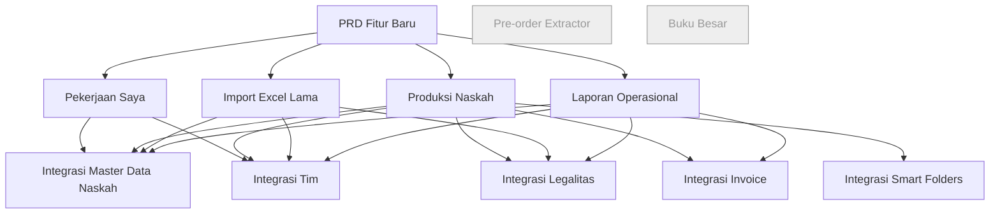
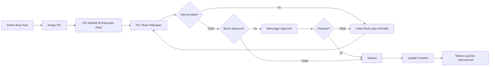
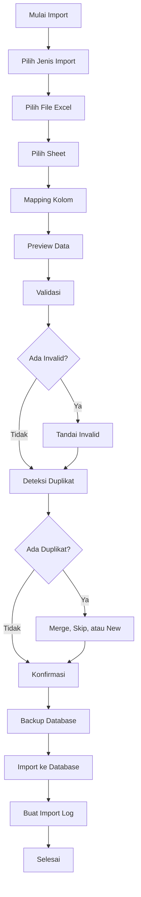
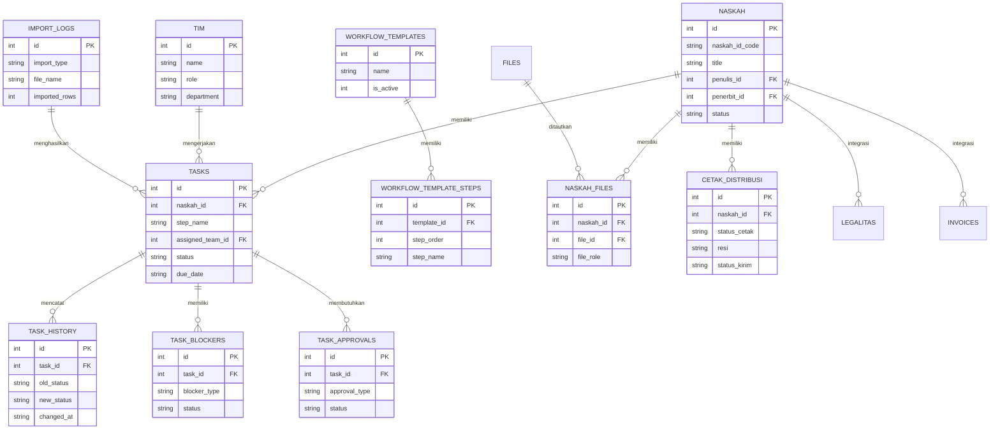
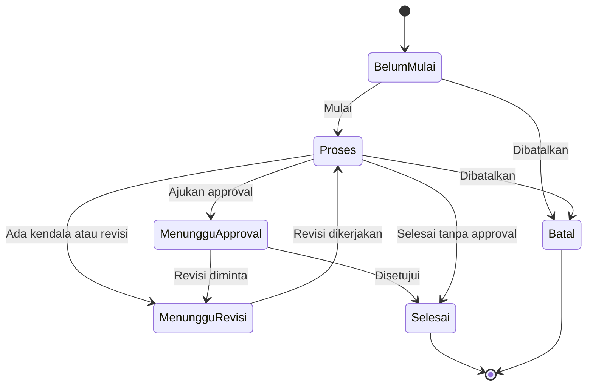

# PRD Fitur Baru PubDesk: Workflow Produksi Naskah dan Migrasi Excel

## 1. Ringkasan Dokumen

**Nama produk:** PubDesk
**Dokumen:** Product Requirements Document
**Versi:** 1.1
**Fokus PRD:** Fitur baru untuk menggantikan 3 Excel operasional
**Fitur lama:** Tidak masuk scope PRD, hanya menjadi titik integrasi
**Fitur yang dikecualikan:** Pre-order Extractor dan Buku Besar

---

# 2. Prinsip Scope

PRD ini hanya membahas fitur baru yang perlu dibangun untuk menyelesaikan masalah 3 Excel lama.

Fitur lama tidak ditulis sebagai requirement utama. Fitur lama hanya muncul dalam bagian integrasi karena fitur baru perlu membaca atau menulis data ke modul existing.

## 2.1 Fitur Baru dalam Scope

```text
1. Pekerjaan Saya
2. Produksi Naskah
3. Import Excel Lama
4. Laporan Operasional
```

## 2.2 Fitur Existing yang Menjadi Titik Integrasi

```text
1. Master Data > Naskah
2. Master Data > Penulis
3. Master Data > Penerbit
4. Master Data > Tim
5. Master Data > Legalitas
6. Master Data > Layanan
7. Invoice
8. Smart Folders
9. Settings
```

## 2.3 Fitur yang Tidak Masuk Scope

```text
1. Pre-order Extractor
2. Buku Besar
3. Akuntansi lengkap
4. WhatsApp automation
5. Marketplace API
6. Multi-user cloud database real-time
7. AI extraction
```

---

# 3. Latar Belakang Masalah

Operasional penerbitan masih memakai 3 Excel utama:

## 3.1 Alur Naskah.xlsx

Excel ini mencatat tahapan kerja naskah dari awal sampai akhir. Di dalamnya ada informasi DP, pelunasan, naskah masuk, layout, cover, surat keaslian, pengajuan legalitas, cetak, upload, resi, testimoni, dan status akhir.

Masalah utama:

```text
1. Kolom terlalu panjang.
2. Status ditulis manual.
3. Sulit melihat progres satu naskah.
4. Sulit tahu pekerjaan terlambat.
5. Sulit audit siapa mengerjakan apa.
```

## 3.2 Naskah Hana.xlsx

Excel ini mencatat naskah masuk, judul, layouter, dan tanggal.

Masalah utama:

```text
1. Data hanya menunjukkan siapa mengerjakan judul tertentu.
2. Tidak menunjukkan status lengkap.
3. Tidak ada deadline.
4. Tidak ada histori revisi.
5. Tidak ada dashboard beban kerja.
```

## 3.3 PENGAJUAN ISBN QRCBN QRSBN HAKI.xlsx

Excel ini mencatat pengajuan ISBN, E-ISBN, QRCBN, QRSBN, dan HAKI.

Masalah utama:

```text
1. Status tidak konsisten.
2. Pengajuan legalitas tidak selalu terhubung rapi ke naskah.
3. Nomor dokumen dan bukti dokumen sulit dilacak.
4. Sulit melihat legalitas yang revisi, ditolak, atau belum keluar.
```

---

# 4. Tujuan Produk

## 4.1 Tujuan Utama

Membangun fitur workflow produksi naskah yang menggantikan pencatatan manual dari 3 Excel lama.

## 4.2 Tujuan Spesifik

```text
1. Karyawan dapat melihat dan memperbarui pekerjaan sendiri.
2. Admin dapat memantau seluruh produksi naskah.
3. Admin dapat mengimpor data lama dari Excel.
4. Pimpinan dapat melihat laporan operasional.
5. Setiap tugas produksi terhubung ke master data naskah.
6. Setiap perubahan status tugas memiliki histori.
7. Data produksi, legalitas, invoice, file, dan tim dapat terbaca dalam satu alur kerja.
```

---

# 5. Pengguna

## 5.1 Admin Produksi

Kebutuhan:

```text
1. Membuat tugas produksi.
2. Menugaskan PIC.
3. Mengatur deadline.
4. Melihat semua pekerjaan aktif.
5. Melihat tugas terlambat.
6. Melihat revisi dan kendala.
7. Mengelola approval.
```

## 5.2 Karyawan atau PIC

Kebutuhan:

```text
1. Melihat pekerjaan sendiri.
2. Mengubah status tugas.
3. Menulis catatan kendala.
4. Melampirkan bukti pekerjaan.
5. Menandai tugas selesai.
```

## 5.3 Koordinator atau Pimpinan

Kebutuhan:

```text
1. Melihat laporan produksi.
2. Melihat beban kerja tim.
3. Melihat pekerjaan terlambat.
4. Melihat legalitas yang belum selesai.
5. Melihat invoice terkait produksi.
```

---

# 6. Fitur Baru 1: Pekerjaan Saya

## 6.1 Deskripsi

Pekerjaan Saya adalah halaman khusus untuk karyawan. Halaman ini menampilkan daftar tugas yang ditugaskan kepada PIC aktif.

Fitur ini menggantikan pola pencatatan kerja individual pada Excel Naskah Hana.xlsx.

## 6.2 Tujuan

```text
1. Karyawan tidak perlu membuka banyak menu.
2. Karyawan langsung tahu pekerjaan yang harus dikerjakan.
3. Karyawan dapat memperbarui status kerja dalam beberapa klik.
4. Admin dapat melihat update pekerjaan secara real-time di database lokal.
```

## 6.3 Komponen Halaman

```text
1. Ringkasan tugas
2. Filter tugas
3. Daftar tugas
4. Detail tugas
5. Update status
6. Catatan kendala
7. Bukti pekerjaan
```

## 6.4 Status Tugas

```text
Belum Mulai
Proses
Menunggu Revisi
Menunggu Approval
Selesai
Ditolak
Batal
```

## 6.5 Field yang Ditampilkan

| Field        | Keterangan                 |
| ------------ | -------------------------- |
| Judul naskah | Diambil dari master naskah |
| Tahap        | Nama pekerjaan             |
| PIC          | Karyawan yang ditugaskan   |
| Deadline     | Batas waktu pekerjaan      |
| Status       | Status tugas               |
| Prioritas    | Normal, tinggi, urgent     |
| Catatan      | Kendala atau instruksi     |
| Bukti        | Link atau file bukti kerja |

## 6.6 Acceptance Criteria

```text
1. PIC dapat melihat semua tugas miliknya.
2. PIC dapat memfilter tugas berdasarkan status.
3. PIC dapat mengubah status dari Belum Mulai ke Proses.
4. PIC dapat mengubah status ke Menunggu Approval atau Selesai.
5. PIC dapat menambahkan catatan.
6. PIC dapat menambahkan bukti file atau link.
7. Setiap perubahan status tersimpan ke task_history.
8. Tugas overdue diberi indikator visual.
```

## 6.7 Wireframe

```text
┌──────────────────────────────────────────────────────────────┐
│ Pekerjaan Saya                                               │
├──────────────────────────────────────────────────────────────┤
│ 4 Aktif | 2 Deadline Dekat | 1 Terlambat | 5 Selesai Minggu Ini│
├──────────────────────────────────────────────────────────────┤
│ [Semua] [Hari Ini] [Terlambat] [Revisi] [Approval] [Selesai] │
├──────────────────────────────────────────────────────────────┤
│ Judul       Tahap          Deadline      Status        Aksi   │
│ Buku A      Layout         24 Jun 2026   Proses        Update │
│ Buku B      Cover          25 Jun 2026   Belum Mulai   Mulai  │
│ Buku C      Revisi Cover   22 Jun 2026   Terlambat     Update │
└──────────────────────────────────────────────────────────────┘
```

---

# 7. Fitur Baru 2: Produksi Naskah

## 7.1 Deskripsi

Produksi Naskah adalah pusat monitoring semua pekerjaan produksi. Fitur ini menggantikan Alur Naskah.xlsx.

## 7.2 Tujuan

```text
1. Admin dapat melihat seluruh proses produksi.
2. Admin dapat memantau status tiap tahap.
3. Admin dapat melihat pekerjaan terlambat.
4. Admin dapat mengelola revisi, kendala, dan approval.
5. Admin dapat melihat timeline produksi.
```

## 7.3 Subfitur

```text
1. Board Produksi
2. Daftar Tugas
3. Revisi dan Kendala
4. Approval
5. Timeline Produksi
```

---

## 7.4 Board Produksi

### Deskripsi

Board Produksi menampilkan tugas dalam bentuk kolom status.

### Kolom Board

```text
Belum Mulai
Proses
Menunggu Revisi
Menunggu Approval
Selesai
Terlambat
```

### Acceptance Criteria

```text
1. Admin dapat melihat tugas berdasarkan status.
2. Admin dapat memfilter berdasarkan PIC.
3. Admin dapat memfilter berdasarkan penerbit.
4. Admin dapat memfilter berdasarkan tahap.
5. Admin dapat memfilter berdasarkan deadline.
6. Admin dapat membuka detail tugas dari kartu board.
```

### Wireframe

```text
┌──────────────────────────────────────────────────────────────┐
│ Produksi Naskah > Board Produksi                             │
├──────────────────────────────────────────────────────────────┤
│ [PIC ▼] [Tahap ▼] [Penerbit ▼] [Deadline ▼] [Cari]           │
├────────────┬────────────┬─────────────────┬────────────┬─────┤
│ Belum Mulai│ Proses     │ Menunggu Revisi │ Approval   │ Done│
├────────────┼────────────┼─────────────────┼────────────┼─────┤
│ Buku B     │ Buku A     │ Buku C          │ Buku D     │Buku E│
│ Layout     │ Layout     │ Cover           │ ACC Cetak  │Resi │
│ PIC Ika    │ PIC Ika    │ PIC Dini        │ Admin      │Admin│
│ 25 Jun     │ 24 Jun     │ 22 Jun          │ 23 Jun     │Done │
└────────────┴────────────┴─────────────────┴────────────┴─────┘
```

---

## 7.5 Daftar Tugas

### Deskripsi

Daftar Tugas adalah tampilan tabel untuk seluruh task produksi.

### Kolom Tabel

| Kolom     | Keterangan       |
| --------- | ---------------- |
| ID Task   | Kode tugas       |
| ID Naskah | Relasi ke naskah |
| Judul     | Judul naskah     |
| Tahap     | Tahap produksi   |
| PIC       | Karyawan         |
| Mulai     | Tanggal mulai    |
| Deadline  | Batas waktu      |
| Selesai   | Tanggal selesai  |
| Status    | Status task      |
| Catatan   | Kendala          |
| Bukti     | Link atau file   |

### Acceptance Criteria

```text
1. Admin dapat membuat task manual.
2. Admin dapat mengubah PIC.
3. Admin dapat mengubah deadline.
4. Admin dapat mengubah status.
5. Admin dapat melihat task overdue.
6. Admin dapat export daftar tugas.
```

---

## 7.6 Revisi dan Kendala

### Deskripsi

Subfitur ini menampilkan semua pekerjaan yang tertahan karena revisi atau kendala.

### Kategori Kendala

```text
Data penulis belum lengkap
Naskah belum diterima
Surat keaslian belum masuk
Menunggu revisi layout
Menunggu revisi cover
Legalitas ditolak
Menunggu pembayaran
Menunggu ACC cetak
Belum ada file final
Belum ada resi
```

### Acceptance Criteria

```text
1. Admin dapat membuat catatan kendala.
2. Admin dapat menghubungkan kendala ke task.
3. Admin dapat menghubungkan kendala ke naskah.
4. Admin dapat memberi status kendala: Aktif atau Selesai.
5. Kendala aktif tampil di detail naskah.
```

---

## 7.7 Approval

### Deskripsi

Approval dipakai untuk tahap yang perlu persetujuan admin atau koordinator.

### Jenis Approval

```text
ACC layout
ACC cover
ACC cetak
ACC upload Playbook
ACC upload Shopee
ACC upload OMP
ACC pengiriman
```

### Acceptance Criteria

```text
1. Admin dapat melihat task Menunggu Approval.
2. Admin dapat menyetujui task.
3. Admin dapat menolak task.
4. Admin dapat meminta revisi.
5. Keputusan approval masuk ke task_history.
```

---

## 7.8 Timeline Produksi

### Deskripsi

Timeline Produksi menampilkan riwayat status task dan event produksi.

### Acceptance Criteria

```text
1. Timeline menampilkan event berdasarkan tanggal.
2. Timeline menampilkan PIC.
3. Timeline menampilkan perubahan status.
4. Timeline dapat difilter berdasarkan naskah.
5. Timeline dapat difilter berdasarkan PIC.
```

---

# 8. Fitur Baru 3: Import Excel Lama

## 8.1 Deskripsi

Import Excel Lama adalah fitur migrasi data dari 3 Excel operasional ke database PubDesk.

## 8.2 Jenis Import

```text
1. Import Alur Naskah
2. Import Naskah Masuk
3. Import Legalitas
```

## 8.3 Alur Import

```text
1. Pilih jenis import.
2. Pilih file Excel.
3. Pilih sheet.
4. Mapping kolom.
5. Preview data.
6. Validasi data.
7. Deteksi duplikat.
8. Konfirmasi import.
9. Simpan ke database.
10. Buat import log.
```

## 8.4 Mapping Target

| Sumber Excel                         | Target Baru                                            |
| ------------------------------------ | ------------------------------------------------------ |
| Alur Naskah.xlsx                     | tasks, task_history, workflow_events, cetak_distribusi |
| Naskah Hana.xlsx                     | tasks, relasi tim ke tugas                             |
| PENGAJUAN ISBN QRCBN QRSBN HAKI.xlsx | legalitas existing, task legalitas jika diperlukan     |

## 8.5 Deteksi Duplikat

Sistem mendeteksi duplikat berdasarkan kombinasi:

```text
1. Judul naskah
2. Nama penulis
3. Penerbit
4. Tanggal masuk
5. Jenis legalitas
6. Nama PIC
```

## 8.6 Status Mapping

Contoh normalisasi status:

| Status Lama    | Status Baru    |
| -------------- | -------------- |
| sudah          | Selesai        |
| Sudah Keluar   | Selesai        |
| pengajuan      | Diajukan       |
| Pengajuan      | Diajukan       |
| belum          | Belum Mulai    |
| Ditolak        | Ditolak        |
| Diajukan ulang | Diajukan Ulang |

## 8.7 Acceptance Criteria

```text
1. Admin dapat memilih file Excel.
2. Sistem dapat membaca daftar sheet.
3. Admin dapat mapping kolom manual.
4. Sistem menampilkan preview data.
5. Sistem menandai data invalid.
6. Sistem menandai potensi duplikat.
7. Admin dapat memilih Merge, Skip, atau Create New.
8. Sistem menyimpan hasil import ke tabel target.
9. Sistem membuat log import.
10. Sistem membuat backup sebelum import massal.
```

## 8.8 Wireframe

```text
┌──────────────────────────────────────────────────────────────┐
│ Import Excel Lama                                            │
├──────────────────────────────────────────────────────────────┤
│ Step 1: Jenis Import                                         │
│ ( ) Alur Naskah                                              │
│ ( ) Naskah Masuk                                             │
│ ( ) Legalitas                                                │
│                                                              │
│ Step 2: File                                                 │
│ [Pilih File Excel]                                           │
│                                                              │
│ Step 3: Mapping Kolom                                        │
│ Kolom Excel              Field Sistem                        │
│ Judul Buku          ->   naskah.title                        │
│ Layouter            ->   tasks.assigned_team_id              │
│ Tanggal             ->   tasks.start_date                    │
│ Status              ->   tasks.status                        │
│                                                              │
│ [Preview] [Validasi] [Import]                                │
└──────────────────────────────────────────────────────────────┘
```

## 8.9 Wireframe Preview

```text
┌──────────────────────────────────────────────────────────────┐
│ Preview Import                                               │
├──────────────────────────────────────────────────────────────┤
│ Total: 2.130 | Valid: 2.050 | Invalid: 30 | Duplikat: 50     │
├──────────────────────────────────────────────────────────────┤
│ Status    Judul      Penulis    PIC       Aksi               │
│ Valid     Buku A     Andi       Ika       Import             │
│ Duplikat  Buku B     Rina       Dini      Merge / Skip / New │
│ Invalid   -          Budi       Sopita    Perbaiki           │
└──────────────────────────────────────────────────────────────┘
```

---

# 9. Fitur Baru 4: Laporan Operasional

## 9.1 Deskripsi

Laporan Operasional menyajikan rekap dari data task, timeline, legalitas, invoice, file, dan distribusi.

## 9.2 Jenis Laporan

```text
1. Laporan Produksi
2. Laporan Kinerja Tim
3. Laporan Legalitas
4. Laporan Invoice Terkait Produksi
5. Laporan Cetak dan Distribusi
```

## 9.3 Metrik Utama

| Metrik              | Rumus                                       |
| ------------------- | ------------------------------------------- |
| Total naskah aktif  | Count naskah dengan task aktif              |
| Task selesai        | Count task status Selesai                   |
| Task overdue        | due_date < today dan status bukan Selesai   |
| Beban kerja PIC     | Count task aktif per PIC                    |
| Progress naskah     | task selesai / total task                   |
| Durasi task         | completed_date - start_date                 |
| Legalitas proses    | Count legalitas status Diajukan atau Revisi |
| Invoice belum lunas | Count invoice status belum lunas atau DP    |
| Belum ada resi      | Count distribusi tanpa resi                 |

## 9.4 Acceptance Criteria

```text
1. User dapat melihat laporan produksi.
2. User dapat melihat laporan kinerja tim.
3. User dapat melihat laporan legalitas.
4. User dapat melihat laporan invoice terkait produksi.
5. User dapat filter berdasarkan periode, PIC, penerbit, paket, dan status.
6. User dapat export laporan ke Excel.
7. User dapat export ringkasan ke PDF.
```

## 9.5 Wireframe

```text
┌──────────────────────────────────────────────────────────────┐
│ Laporan Operasional                                          │
├──────────────────────────────────────────────────────────────┤
│ [Periode ▼] [PIC ▼] [Penerbit ▼] [Status ▼] [Export Excel]  │
├──────────────────────────────────────────────────────────────┤
│ ┌─────────────┐ ┌─────────────┐ ┌─────────────┐ ┌──────────┐ │
│ │Naskah Aktif │ │Selesai      │ │Overdue      │ │Legalitas │ │
│ │124          │ │38           │ │12           │ │27 Proses │ │
│ └─────────────┘ └─────────────┘ └─────────────┘ └──────────┘ │
│                                                              │
│ Beban Kerja Tim                                              │
│ Ika: 32 tugas | Dini: 28 tugas | Sopita: 25 tugas            │
│                                                              │
│ Task Terlambat                                               │
│ Buku A | Layout | PIC Ika | Due 20 Jun 2026                  │
│ Buku B | Cover  | PIC Dini | Due 21 Jun 2026                 │
└──────────────────────────────────────────────────────────────┘
```

---

# 10. Integrasi dengan Fitur Existing

Bagian ini hanya menjelaskan koneksi fitur baru ke fitur lama. Fitur lama tidak menjadi scope pembangunan PRD ini.

## 10.1 Integrasi dengan Master Data Naskah

Fitur baru membaca data dari Master Data Naskah untuk:

```text
1. Menampilkan judul naskah.
2. Menampilkan ID naskah.
3. Menampilkan penulis dan penerbit.
4. Menampilkan status utama.
5. Menghubungkan task ke naskah.
6. Menghitung progress per naskah.
```

Data yang dibutuhkan:

```text
naskah.id
naskah.naskah_id_code
naskah.title
naskah.penulis_id
naskah.penerbit_id
naskah.package_type
naskah.status
```

## 10.2 Integrasi dengan Master Data Tim

Fitur baru membaca data Tim untuk:

```text
1. Menentukan PIC.
2. Menampilkan role.
3. Menampilkan departemen.
4. Menghitung beban kerja.
5. Menghitung tugas selesai per PIC.
```

Data yang dibutuhkan:

```text
tim.id
tim.name
tim.role
tim.department
tim.weekly_target
tim.is_active
```

## 10.3 Integrasi dengan Master Data Legalitas

Fitur baru membaca dan memperbarui data Legalitas untuk:

```text
1. Menampilkan status legalitas di Produksi Naskah.
2. Menghasilkan laporan legalitas.
3. Menautkan pengajuan legalitas ke task.
4. Menandai pengajuan yang revisi, ditolak, atau selesai.
```

Data yang dibutuhkan:

```text
legalitas.id
legalitas.naskah_id
legalitas.tipe
legalitas.tanggal_pengajuan
legalitas.status
legalitas.keterangan
```

Tambahan field yang dibutuhkan:

```text
nomor_dokumen
tanggal_keluar
tanggal_revisi
pic_id
rejection_reason
proof_path_or_link
```

## 10.4 Integrasi dengan Master Data Layanan

Fitur baru membaca layanan untuk:

```text
1. Menentukan template workflow.
2. Menentukan tahapan standar per paket.
3. Menentukan SLA atau durasi default.
```

Data yang dibutuhkan:

```text
services.id
services.name
services.category
services.price
```

## 10.5 Integrasi dengan Invoice

Fitur baru membaca invoice untuk:

```text
1. Menampilkan status pembayaran pada produksi.
2. Menandai naskah yang masih DP.
3. Menandai naskah yang belum lunas.
4. Menghasilkan laporan invoice terkait produksi.
```

Tambahan field yang dibutuhkan:

```text
naskah_id
payment_status
paid_amount
remaining_amount
payment_notes
```

## 10.6 Integrasi dengan Smart Folders

Fitur baru membaca dan menautkan file untuk:

```text
1. Melampirkan bukti pekerjaan.
2. Menghubungkan file layout ke naskah.
3. Menghubungkan file cover ke naskah.
4. Menghubungkan surat keaslian ke naskah.
5. Menghubungkan dokumen legalitas ke naskah.
6. Menghubungkan resi atau bukti pengiriman ke naskah.
```

Relasi baru yang dibutuhkan:

```text
naskah_files
```

## 10.7 Integrasi dengan Settings

Fitur baru membaca Settings untuk:

```text
1. Status workflow.
2. Status legalitas.
3. Template deadline.
4. Backup database sebelum import.
5. Folder pantauan file.
```

---

# 11. Data Model Baru

## 11.1 Tabel `workflow_templates`

```sql
CREATE TABLE workflow_templates (
    id INTEGER PRIMARY KEY AUTOINCREMENT,
    name TEXT NOT NULL,
    description TEXT,
    is_active INTEGER NOT NULL DEFAULT 1,
    created_at TEXT NOT NULL
);
```

## 11.2 Tabel `workflow_template_steps`

```sql
CREATE TABLE workflow_template_steps (
    id INTEGER PRIMARY KEY AUTOINCREMENT,
    template_id INTEGER NOT NULL REFERENCES workflow_templates(id) ON DELETE CASCADE,
    step_order INTEGER NOT NULL,
    step_name TEXT NOT NULL,
    default_role TEXT,
    default_duration_days INTEGER DEFAULT 0,
    is_required INTEGER NOT NULL DEFAULT 1
);
```

## 11.3 Tabel `tasks`

```sql
CREATE TABLE tasks (
    id INTEGER PRIMARY KEY AUTOINCREMENT,
    naskah_id INTEGER NOT NULL REFERENCES naskah(id) ON DELETE CASCADE,
    step_name TEXT NOT NULL,
    step_order INTEGER,
    assigned_team_id INTEGER REFERENCES tim(id),
    status TEXT NOT NULL DEFAULT 'Belum Mulai',
    priority TEXT NOT NULL DEFAULT 'Normal',
    start_date TEXT,
    due_date TEXT,
    completed_date TEXT,
    notes TEXT,
    proof_path_or_link TEXT,
    created_at TEXT NOT NULL,
    updated_at TEXT
);
```

## 11.4 Tabel `task_history`

```sql
CREATE TABLE task_history (
    id INTEGER PRIMARY KEY AUTOINCREMENT,
    task_id INTEGER NOT NULL REFERENCES tasks(id) ON DELETE CASCADE,
    old_status TEXT,
    new_status TEXT NOT NULL,
    changed_by TEXT,
    changed_at TEXT NOT NULL,
    notes TEXT
);
```

## 11.5 Tabel `task_blockers`

```sql
CREATE TABLE task_blockers (
    id INTEGER PRIMARY KEY AUTOINCREMENT,
    task_id INTEGER REFERENCES tasks(id) ON DELETE CASCADE,
    naskah_id INTEGER REFERENCES naskah(id) ON DELETE CASCADE,
    blocker_type TEXT NOT NULL,
    description TEXT,
    status TEXT NOT NULL DEFAULT 'Aktif',
    created_at TEXT NOT NULL,
    resolved_at TEXT
);
```

## 11.6 Tabel `task_approvals`

```sql
CREATE TABLE task_approvals (
    id INTEGER PRIMARY KEY AUTOINCREMENT,
    task_id INTEGER NOT NULL REFERENCES tasks(id) ON DELETE CASCADE,
    approval_type TEXT NOT NULL,
    status TEXT NOT NULL DEFAULT 'Menunggu Approval',
    requested_at TEXT NOT NULL,
    decided_at TEXT,
    decided_by TEXT,
    notes TEXT
);
```

## 11.7 Tabel `naskah_files`

```sql
CREATE TABLE naskah_files (
    id INTEGER PRIMARY KEY AUTOINCREMENT,
    naskah_id INTEGER NOT NULL REFERENCES naskah(id) ON DELETE CASCADE,
    file_id INTEGER NOT NULL REFERENCES files(id) ON DELETE CASCADE,
    file_role TEXT NOT NULL,
    notes TEXT,
    created_at TEXT NOT NULL
);
```

## 11.8 Tabel `cetak_distribusi`

```sql
CREATE TABLE cetak_distribusi (
    id INTEGER PRIMARY KEY AUTOINCREMENT,
    naskah_id INTEGER NOT NULL REFERENCES naskah(id) ON DELETE CASCADE,
    acc_cetak_date TEXT,
    naik_cetak_date TEXT,
    jumlah_cetak INTEGER,
    status_cetak TEXT DEFAULT 'Belum Mulai',
    link_playbook TEXT,
    link_shopee TEXT,
    link_omp TEXT,
    ekspedisi TEXT,
    resi TEXT,
    tanggal_kirim TEXT,
    status_kirim TEXT DEFAULT 'Belum Dikirim',
    notes TEXT,
    created_at TEXT NOT NULL,
    updated_at TEXT
);
```

## 11.9 Tabel `import_logs`

```sql
CREATE TABLE import_logs (
    id INTEGER PRIMARY KEY AUTOINCREMENT,
    import_type TEXT NOT NULL,
    file_name TEXT NOT NULL,
    sheet_name TEXT,
    total_rows INTEGER DEFAULT 0,
    valid_rows INTEGER DEFAULT 0,
    invalid_rows INTEGER DEFAULT 0,
    duplicate_rows INTEGER DEFAULT 0,
    imported_rows INTEGER DEFAULT 0,
    created_at TEXT NOT NULL,
    notes TEXT
);
```

## 11.10 Alter Table Existing

```sql
ALTER TABLE legalitas ADD COLUMN nomor_dokumen TEXT;
ALTER TABLE legalitas ADD COLUMN tanggal_keluar TEXT;
ALTER TABLE legalitas ADD COLUMN tanggal_revisi TEXT;
ALTER TABLE legalitas ADD COLUMN pic_id INTEGER REFERENCES tim(id);
ALTER TABLE legalitas ADD COLUMN rejection_reason TEXT;
ALTER TABLE legalitas ADD COLUMN proof_path_or_link TEXT;

ALTER TABLE invoices ADD COLUMN naskah_id INTEGER REFERENCES naskah(id);
ALTER TABLE invoices ADD COLUMN payment_status TEXT DEFAULT 'Draft';
ALTER TABLE invoices ADD COLUMN paid_amount REAL DEFAULT 0;
ALTER TABLE invoices ADD COLUMN remaining_amount REAL DEFAULT 0;
ALTER TABLE invoices ADD COLUMN payment_notes TEXT;
```

---

# 12. Tauri Commands Baru

## 12.1 Tasks

```text
get_tasks
get_task_by_id
get_tasks_by_naskah
get_tasks_by_team
get_my_tasks
get_overdue_tasks
add_task
update_task
update_task_status
delete_task
```

## 12.2 Task History

```text
get_task_history
add_task_history
```

## 12.3 Blockers

```text
get_task_blockers
add_task_blocker
update_task_blocker
resolve_task_blocker
delete_task_blocker
```

## 12.4 Approvals

```text
get_task_approvals
request_task_approval
approve_task
reject_task
request_revision
```

## 12.5 Workflow Template

```text
get_workflow_templates
add_workflow_template
update_workflow_template
delete_workflow_template
get_workflow_template_steps
add_workflow_template_step
update_workflow_template_step
delete_workflow_template_step
generate_tasks_from_template
```

## 12.6 Import Excel

```text
read_excel_sheets
preview_excel_import
validate_excel_import
detect_import_duplicates
execute_excel_import
get_import_logs
```

## 12.7 Reports

```text
get_production_report
get_team_performance_report
get_legalitas_report
get_invoice_production_report
get_distribution_report
export_report_excel
export_report_pdf
```

---

# 13. Mermaid Diagrams

## 13.1 Scope Diagram



## 13.2 Workflow Produksi



## 13.3 Import Excel Lama



## 13.4 ERD Fitur Baru dan Integrasi



## 13.5 State Diagram Task



---

# 14. MVP

## 14.1 MVP Wajib

```text
1. Pekerjaan Saya
2. Produksi Naskah: Daftar Tugas
3. Produksi Naskah: Board Produksi sederhana
4. Update status task
5. Task history
6. Revisi dan kendala
7. Approval dasar
8. Import Excel Lama dengan mapping dan preview
9. Laporan Operasional sederhana
10. Integrasi task ke naskah, tim, legalitas, invoice, dan file
```

## 14.2 Tidak Masuk MVP

```text
1. Drag and drop board
2. Grafik kompleks
3. AI import mapping
4. Role permission detail
5. Sync cloud multi-user
6. Marketplace API
7. WhatsApp automation
```

---

# 15. Roadmap

## Phase 1: Database dan Commands

Output:

```text
1. Tabel tasks
2. Tabel task_history
3. Tabel task_blockers
4. Tabel task_approvals
5. Tabel workflow_templates
6. Tabel workflow_template_steps
7. Tabel naskah_files
8. Tabel cetak_distribusi
9. Tabel import_logs
10. Tauri commands baru
```

## Phase 2: Pekerjaan Saya

Output:

```text
1. Halaman Pekerjaan Saya
2. Filter status
3. Update status
4. Catatan kendala
5. Bukti pekerjaan
```

## Phase 3: Produksi Naskah

Output:

```text
1. Daftar Tugas
2. Board Produksi
3. Revisi dan Kendala
4. Approval
5. Timeline Produksi
```

## Phase 4: Import Excel Lama

Output:

```text
1. Pilih file Excel
2. Pilih sheet
3. Mapping kolom
4. Preview
5. Validasi
6. Deteksi duplikat
7. Import log
```

## Phase 5: Laporan Operasional

Output:

```text
1. Laporan produksi
2. Laporan kinerja tim
3. Laporan legalitas
4. Laporan invoice produksi
5. Export Excel
```

---

# 16. Definition of Done

Fitur dianggap selesai jika:

```text
1. PIC dapat melihat pekerjaan sendiri.
2. PIC dapat update status tugas.
3. Admin dapat melihat semua tugas produksi.
4. Admin dapat membuat tugas dan menetapkan PIC.
5. Admin dapat mencatat revisi dan kendala.
6. Admin dapat menyetujui atau meminta revisi task.
7. Setiap perubahan status masuk ke task_history.
8. Data Excel lama dapat dipreview sebelum import.
9. Data duplikat dapat ditandai sebelum import.
10. Laporan operasional dapat menampilkan produksi, kinerja tim, legalitas, dan invoice.
11. Semua fitur baru terhubung ke master data existing tanpa menulis ulang modul existing.
```

---

# 17. Kesimpulan

PRD ini hanya memuat fitur baru yang dibutuhkan untuk menggantikan tiga Excel operasional. Fitur lama tidak masuk ruang lingkup pembangunan, tetapi menjadi titik integrasi data. Dengan batasan ini, pengembangan menjadi lebih fokus, tidak mencampur fitur existing dengan fitur baru, dan langsung menjawab masalah utama operasional: pencatatan kerja, monitoring produksi, migrasi Excel, dan laporan.
