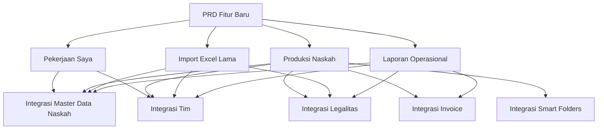
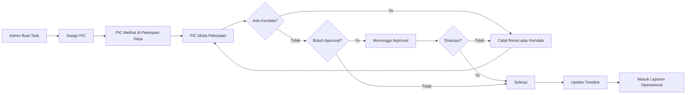
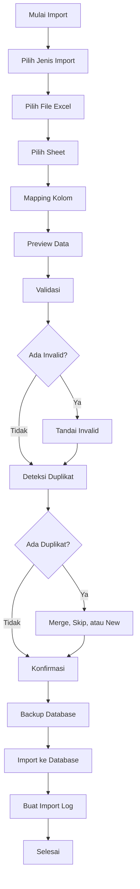
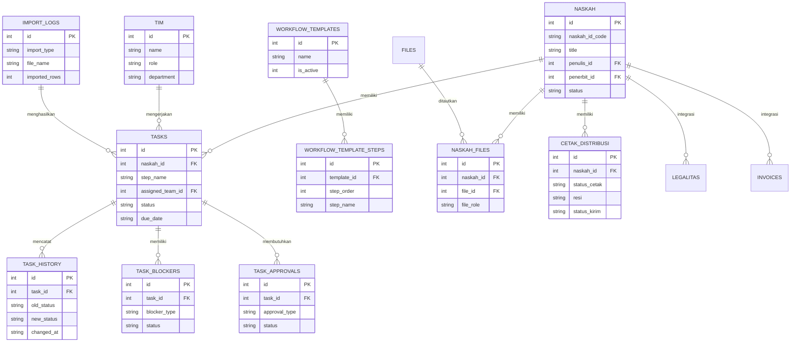
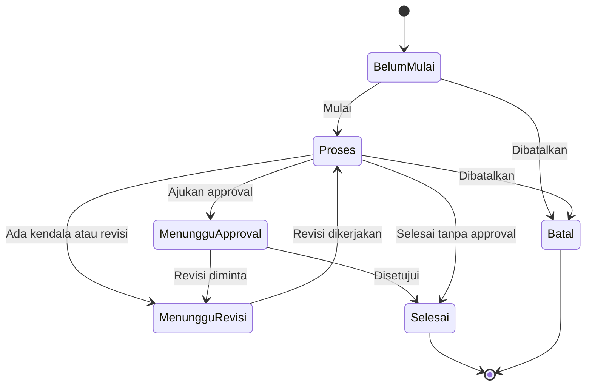

# Mermaid Diagram

## 1. Scope Diagram

```mermaid
flowchart TD
    A[PRD Fitur Baru] --> B[Pekerjaan Saya]
    A --> C[Produksi Naskah]
    A --> D[Import Excel Lama]
    A --> E[Laporan Operasional]

    B --> F[Integrasi Master Data Naskah]
    B --> G[Integrasi Tim]

    C --> F
    C --> G
    C --> H[Integrasi Legalitas]
    C --> I[Integrasi Invoice]
    C --> J[Integrasi Smart Folders]

    D --> F
    D --> G
    D --> H

    E --> F
    E --> G
    E --> H
    E --> I
```

## 2. Workflow Produksi

```mermaid
flowchart LR
    A[Admin Buat Task] --> B[Assign PIC]
    B --> C[PIC Melihat di Pekerjaan Saya]
    C --> D[PIC Mulai Pekerjaan]
    D --> E{Ada Kendala?}
    E -->|Ya| F[Catat Revisi atau Kendala]
    F --> D
    E -->|Tidak| G{Butuh Approval?}
    G -->|Ya| H[Menunggu Approval]
    H --> I{Disetujui?}
    I -->|Tidak| F
    I -->|Ya| J[Selesai]
    G -->|Tidak| J
    J --> K[Update Timeline]
    K --> L[Masuk Laporan Operasional]
```

## 3. Import Excel Lama

```mermaid
flowchart TD
    A[Mulai Import] --> B[Pilih Jenis Import]
    B --> C[Pilih File Excel]
    C --> D[Pilih Sheet]
    D --> E[Mapping Kolom]
    E --> F[Preview Data]
    F --> G[Validasi]
    G --> H{Ada Invalid?}
    H -->|Ya| I[Tandai Invalid]
    H -->|Tidak| J[Deteksi Duplikat]
    I --> J
    J --> K{Ada Duplikat?}
    K -->|Ya| L[Merge, Skip, atau New]
    K -->|Tidak| M[Konfirmasi]
    L --> M
    M --> N[Backup Database]
    N --> O[Import ke Database]
    O --> P[Buat Import Log]
    P --> Q[Selesai]
```

## 4. ERD

```mermaid
erDiagram
    NASKAH ||--o{ TASKS : memiliki
    TIM ||--o{ TASKS : mengerjakan
    TASKS ||--o{ TASK_HISTORY : mencatat
    TASKS ||--o{ TASK_BLOCKERS : memiliki
    TASKS ||--o{ TASK_APPROVALS : membutuhkan
    WORKFLOW_TEMPLATES ||--o{ WORKFLOW_TEMPLATE_STEPS : memiliki
    NASKAH ||--o{ NASKAH_FILES : memiliki
    FILES ||--o{ NASKAH_FILES : ditautkan
    NASKAH ||--o{ CETAK_DISTRIBUSI : memiliki
    NASKAH ||--o{ LEGALITAS : integrasi
    NASKAH ||--o{ INVOICES : integrasi
    IMPORT_LOGS ||--o{ TASKS : menghasilkan

    NASKAH {
        int id PK
        string naskah_id_code
        string title
        int penulis_id FK
        int penerbit_id FK
        string status
    }

    TIM {
        int id PK
        string name
        string role
        string department
    }

    TASKS {
        int id PK
        int naskah_id FK
        string step_name
        int assigned_team_id FK
        string status
        string due_date
    }

    TASK_HISTORY {
        int id PK
        int task_id FK
        string old_status
        string new_status
        string changed_at
    }

    TASK_BLOCKERS {
        int id PK
        int task_id FK
        string blocker_type
        string status
    }

    TASK_APPROVALS {
        int id PK
        int task_id FK
        string approval_type
        string status
    }

    WORKFLOW_TEMPLATES {
        int id PK
        string name
        int is_active
    }

    WORKFLOW_TEMPLATE_STEPS {
        int id PK
        int template_id FK
        int step_order
        string step_name
    }

    NASKAH_FILES {
        int id PK
        int naskah_id FK
        int file_id FK
        string file_role
    }

    CETAK_DISTRIBUSI {
        int id PK
        int naskah_id FK
        string status_cetak
        string resi
        string status_kirim
    }

    IMPORT_LOGS {
        int id PK
        string import_type
        string file_name
        int imported_rows
    }
```

## 5. State Task

```mermaid
stateDiagram-v2
    [*] --> BelumMulai
    BelumMulai --> Proses: Mulai
    Proses --> MenungguRevisi: Ada kendala atau revisi
    MenungguRevisi --> Proses: Revisi dikerjakan
    Proses --> MenungguApproval: Ajukan approval
    MenungguApproval --> Selesai: Disetujui
    MenungguApproval --> MenungguRevisi: Revisi diminta
    Proses --> Selesai: Selesai tanpa approval
    BelumMulai --> Batal: Dibatalkan
    Proses --> Batal: Dibatalkan
    Selesai --> [*]
    Batal --> [*]
```
